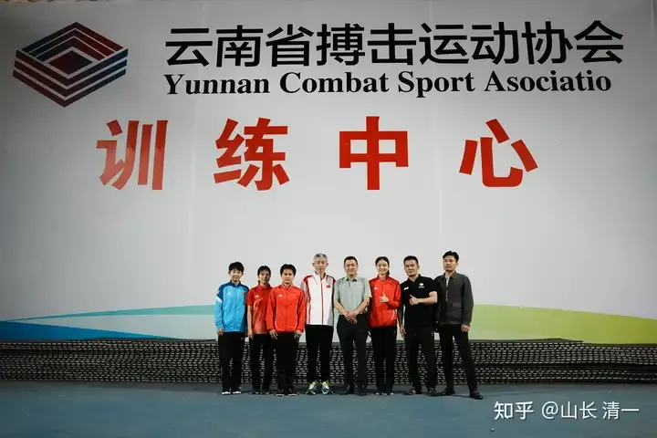
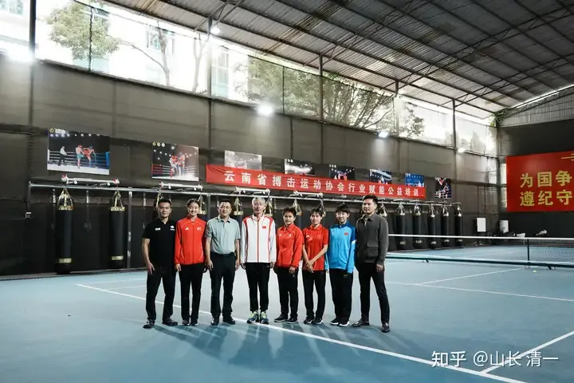

今年， 清一战队要参加五场大型锦标赛！

三场全国锦标赛很快就要举行，都在7-8月份举办！

两场国际赛事：泰拳世界锦标赛（已完成）。还有下半年在沙特利雅得举办的【亚洲室内和武道运动会】待赛中。

明年清一战队应该也有五场以上的全国和国际赛事（明年世锦赛。还有四年一度的世界武道博览会）。清一战队肯定会是更多队员参加的主力战队。

明天，是在海口举办的【青少年自由搏击全国锦标赛】，清一战队冠军班全员出动参赛。此前月中举办的【成人自由搏击全国锦标赛】。清一战队放弃了参赛机会。因为去年我们参赛西安的全国自由搏击锦标赛的感受，非常的不好，所以今年就不去了。

我们成人组，就主要参加泰拳全国锦标赛，这个赛事更光明一些。我们努力在泰拳的世界锦标赛上，为中国争取拿到更多的奖牌吧！自由搏击项目，就让国内的这些武行去为国争光了。我们不跟他们争了！

7月31日，泰拳成人全国锦标赛，将在要昆明石林举办！清一战队会继续参加！去年我们拿到了6块金牌，算是全国集体第一战队。今年努力一点，争取超过6块金牌吧！至于总奖牌数全国第一，应该没有悬念。因为今年武道馆几乎全员出击，还加上了冠军班的人，清一战队总共有20多个拳手参赛，应该也是全国俱乐部派出的参赛人数最多的队伍。

在昆明，与云南搏击协会的赵会长合影。他们是今年全国锦标赛的主办方

很可能这个地方会成为未来国家队的高原训练基地

清一战队过去三年征战全国锦标赛，已经取得了37块金牌！

今年肯定会刷新记录。等8月底，就能看到今年的全国锦标赛的新记录了。

明年，预计是清一战队批量出动，刷新中国武术在世界格斗赛事上创新记录的起点！
