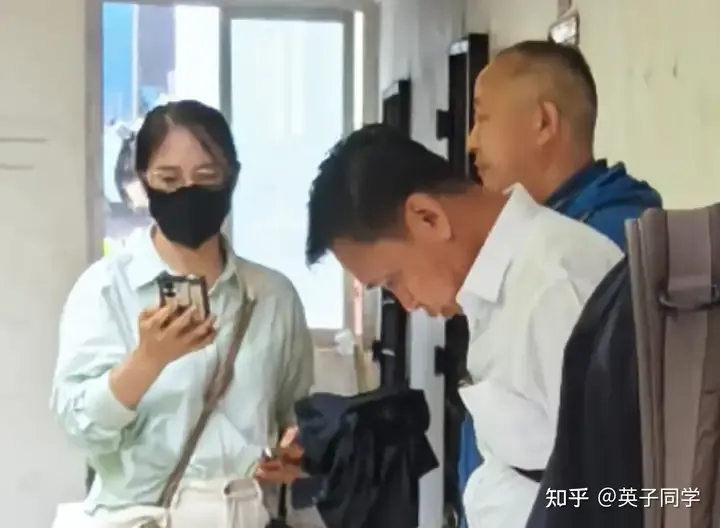
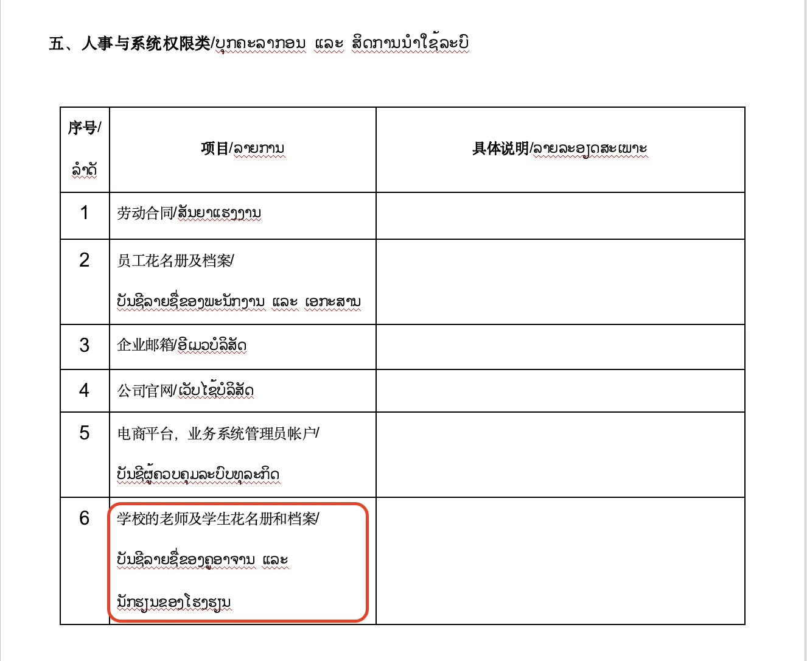

国内的家长们都很关心：

熊杰在老挝法院“胜诉”，是不是意味着我们在磨丁的办学是非法的？会遭遇困难？

是不是老挝的官方，将来会打击和排斥我们？

我们将来在磨丁办学会受到不良影响吗? 磨丁的生活环境，因为我们与老挝的官方“闹翻”了。以后被“针对”后，安全环境能够得到保障吗？

其实：这一切担心，都是不存在的！

而且恰恰相反：经过7月2日的“猎熊行动”之后，无论是老挝和中方的官方人员，都对我们更加了解，也更加支持了！我们将来在老挝的事业开展会更顺利！而且会更安全，更稳定！我们得到了更多的官方支撑和关注以及帮助。而且，老挝国礼计划下半年就要开展起来了，老挝将因为我们的帮助，能够在赛场上走向世界舞台。我们注定是老挝的贵宾！

在7月2日之前，熊杰和黄小燕，长期背后在老挝和国内的政商渠道，散布各种谣言，一度引起了中老管理层的疑惑，对我们的办学充满了怀疑。

现在经过7月2日的事件后，让老挝的各界有机会查清了整个事件的原委，看清了熊黄二人的丑恶嘴脸，领导们对我们办学，也更加关心和支持了！

老挝的官方人员还说：让我们妥善解决这个问题。必须让熊杰来磨丁面对家长。如果他不来，抓也要抓他来的！

但我们也知道：熊杰黄小燕一贯是喜欢背后躲起来玩阴谋，是见不得光的人。因此故意借用“法院胜诉”来为她们的恶劣行做掩护，让人们看不清他们的真实面目。

现在，不知道现在两人才是“过街老鼠，人人喊打！”，他在老挝和国内，都是大名远扬---彻底臭大街了。将来走在路上被认出来，说不定还会被人揍一顿的！黄某人已经吓得到哪里都必须带口罩。我看熊杰以后出来也要戴口罩了。说不定还要装女人！

两只老鼠，跑得快

下面是我在明莉校长发布的情况说明后的留言！

【两位公安让我们放心在磨丁做实事，因为背后站着的是祖国。】
我们选择磨丁办学，就是因为磨丁是中老政府高度关注的特区，不是缅甸果敢区，不是黑社会。只要我们做正事，做好事，就不怕黑！两位中国公安对我们这样说，其实就是让我们放心：中国公安，是不会让少数黑心的老挝人，勾结不法奸商来坑害我们的。让我们好好办学，培养好学生，为国争光。

熊杰总想用黑社会的方式来对付我们，真是瞎了眼！看不清局势。在中国的边境下敢来玩缅甸四大家族的恐怖游戏？熊杰是不是瞎了眼？

目前熊杰黄小燕，还在网上操纵一堆清黑到处乱说话：污蔑我们的正义行为是“暴力抗法”，说我们是利用和煽动家长和学生，来对抗官方的“正常执法”，结局会很不妙，会被老挝人整死了等等。
这就是故意混淆是非，颠倒黑白了！只能糊弄不懂法，不懂政策的傻瓜家长！

实际上，这次来调查后，老挝的官员对我们都是理解和支持的。绝对不会对我们有意见，只是提醒我们不要冲动，要尊重老挝的法律。我们表示：我们只是针对熊杰黄小燕，不针对老挝的任何人！也会尊重老挝的法律，会严格按照法律做事的！

不可否认，任何国家都有贪腐行为，中国有贪官。东南亚国家，包括老挝，肯定有一些腐败官员，会被熊杰的金钱买通，会想要和熊杰私下勾结。谋划夺取和瓜分属于我们教师和和家长，学生们的共同资产。
但毫无疑问：这些人肯定是躲在暗处的，是见不得光的人！只要我们把事情摆在台面上，公开的来处理事情。没有任何官员，敢于公开的冒大不韪，来明火执仗的抢夺家长们的资产！抢夺中国人的资产。

因为老挝也是共产主义国家，而且是中国的小兄弟，不可能有黑官敢来明抢中国人的！又不是印尼。因此，我们把双方的争议摆在阳光下面，就是迫使只会躲在黑暗中算计的人，不敢用暗箭伤人！只能公开出来对阵。

熊杰买通的腐败官员，在这种双方高层官员高度关注的情况下，是绝对不敢公开出头，违法为熊杰黄小燕捞取好处的！他们只会在没人注意的时候，在模糊地带，悄悄的带偏节奏。就像在局势不清的情况下，擂台上歪判的裁判一样。

但如果我们证据确凿，没有裁判敢于公开掠夺的，特别是掠夺中国人，就必须经得起中国公安执法部门的查验！

老挝的法院判决内容是什么？为什么我们没有上诉？
因为老挝官方的判决，是一个极其模糊的结果，就是要求双方协商，归还属于熊杰的这部分管理权。这种判决非常的滑头，其实回避了财产权的判定。只是要求双方“协商解决管理权问题”！老挝的律师都说：不知道法院这个判决是干啥的，要怎样执行才对。差不多等于就是玩模糊概率的口头判决的！但可能执行人可以根据情况“灵活处理”的。这样就给了熊杰一些空间。
而法院对熊杰要求赔偿其损失，以及其他夸大，无理的诉述要求，全都驳回了。因为没有证据的要求，法庭也不敢判决，会把人抓把柄的！

因此，这份法院的判决，其实是无法有效执行的空洞的条文，需要双方核定内容之后，才能执行的！
因此这就是判决后熊杰根本没有来“执行”的原因。而是借用判决的名义。去花钱，去暗中活动，想要联合权力人员来抢东西。想要用执法过程来黑掉我们。我方当然会反制了---要求必须公开公正的处理执行！

如果严格按照法律措施来看：
那么：熊杰申索的“磨丁酒店管理权”是不存在的，因为是他自己主动放弃的管理权（他自动辞职，多人可以作证），谈何被人剥夺了？
熊杰法律上，倒是拥有一个合同，就是他的公司，拥有磨丁酒店的“管理权”，他有一家公司通过合同协议，获得了磨丁酒店的管理权协议。但合同规定：每年要交240万的租金（很低，就是折旧费了），可是，熊杰多年来却一分钱都没有支付过。反而在自己管理酒店的几年里面，卷走了全部的营业款！已经犯了职务侵占罪！
因此按照基本的合同法，酒店已经收回了违背合同的熊杰公司原来得到的酒店管理权，两年前就已经交给第三方酒店公司去管理了！因此熊杰不存在要回来“自己拿到酒店管理权”的问题！他只能拿回他自己公司的管理权， 这个我们也不要的！
至于股权纠纷，不在这次的法院判决里面！是需要重新双方提供证据去判定的！
熊杰真的要拿回来酒店的管理权，起码要把这几年的酒店租金支付掉吧？而且：还要把违约金支付掉吧？现在的酒店公司要退出以后，你才能进入执行管理吧？
相当于你是租客，你必须满足当租客的条件。你起码的租金都没付，就想来靠官方用枪保护你强行使用房子？这肯定不合法呀？谁敢帮你抢？

这都是必须按照法律和企业管理的法规来执行的。你想强抢？想要你看家长依不依？因为酒店就是属于今日学堂的公共资产，是为教师们和学生们，家长们服务的。谁愿意交给这个一分钱都没有出的骗子？而且法律上，也完全不支持熊杰！只有贪官支持！
因此，我们只是把熊杰拥有的酒店管理公司的印章和执照，交给了法院转交给熊杰去“自己管理”。但熊杰恼羞成怒，拒绝接受法院交给他的「酒店公司管理权」！他要的是酒店资产的实控权！
可是从法律上，他根本就没有权利来拿走这些属于大家的资产，他的股权只有25%。不能剥夺其他股东的权力！
因此，熊杰无非是希望，他买通了一些官府，用大量的执法人员，用枪来“吓死我们”。“吓跑我们”。然后他可以浑水摸鱼，把模糊的法院管理权判决，改成他拥有“资产私有权”。用来掠夺家长们的建校资产！这种浑水摸鱼的手法，就是熊杰和黄小燕的惯用手法了！

至于熊黄二人要求的今日国际学校的管理权，就更是笑话了！
第一：两人已经偷走了营业执照和相关的文件，因此：从法律上看，今日国际学校就在他们手上！从两人离开后，就停止办学了！今日国际学校的校园，也没有建起来，他去空地上“管理学校”去吧！
第二：现在在磨丁办学的实体，是【今日三语学校】。而且分为三个学校在分别办学！你狐假虎威，拿个文不对题的法院文件，来找我们执行啥管理权？跟我们现在的三语学校有何关系？
你想管，你就自己来管吧，反正我们这里的师生，全都是三语学校的，你要来拿我们的花名册？你谁呀？凭啥理你？
至于你黄小燕，非要死皮耐脸的要当今日国际学校的校长，就继续当好了。正好今日国际学校欠了很多家长的钱。我们家长正期待熊黄二人来恢复管理学校呢，正好把旧账清掉！
熊黄二人知不知道这情况？当然知道！
知道严格按照法律执行，他们是一点好处也捞不到的！
如果不和我们沟通协商解决，是不可能“执行”出啥东西来的，甚至更糟糕的是：他们连执行的对象都找不到！
我们不理他，他们两人根本就没办法！

他们就是想要拉大旗做虎皮，想要靠官方的一个虚文，靠花钱弄一些执法人员来，摆摆样子吓死人罢了。用几十个拿着冲锋枪的人，在酒店内到处布控，以为这样就能够吓唬住家长们，不敢对他的非法行为有何行动，吃个闷亏，然后让他悄然的夺取校产，我们含恨离开。他和老挝的一些恶狼们一起去分肥！这就是熊杰的精心打算！
而且熊杰更毒的就是：散播谎言，说我们学校有人跳楼，死了人，还说我们不是学校，是“邪教基地”，有政治和宗教危险。想要中老两国的官方对我们痛下杀手！让他们顺利夺取资产！
没想到：熊杰这一招，正好弄巧成拙！反而引起了中老官方的巨大重视。国安，公安，以及行政部门全都动员起来，对我们进行认真的检查和调查了解！
这一下，熊杰原来想要通过买通黑官员。私下吃掉我们的打算，就彻底歇火了！这就是我们最需要的状态！我们巴不得天下皆知。大家都来查查我们有啥问题。
原来熊杰根本就没有证据，就是胡说八道一通，编排谎言，但老挝的法院接受他的起诉和歪理！
我们的律师提供了各种详细的证据，事实，以及陈述了我方的要求，但原来的法院就不接受我方的证据和文件！只采信熊杰的单方面要求！
种种怪异后面，都透出熊杰奸商勾结的痕迹和套路！黑手隐隐出现。
因此，在磨丁的家长和学生们，才在7月2日聚集在磨丁酒店，表示要熊杰黄小燕出来说明真相。让真相大白于天下。。跟清黑诬陷我们【游行示威，暴力抗法】是完全不一样的事实！
我们都是懂法的人，都会严格的按照法律办事，不会给坏人提供借口。更不会暴力抗法的！我们只是展示我们的基本态度罢了，这是合法的！非暴力的！家长们和学生们有权表达自己的意见和反对，但我们并没有去冲击官方。因为我们的敌人不是老挝的官方，而是熊杰黄小燕这种强盗。

法院人员一看现场情况不对，不符合原来的设想预期，就匆匆退走，终止了执行程序。因为发现熊杰方显然撒谎了！情况很复杂，不能乱做事。
最终，此事件，引起中老双方各级政府领导的关注和调查，从万象到昆明，官方都在关注磨丁的事件。
结果当然是清晰的：因为真的就是真的，假的就是假的！
最终中老双方都认可了我们的学校，也认可我们是真正的办学方。要求熊杰黄小燕必须来磨丁解决问题，不能背后使坏！
这就是熊黄二人算尽心机，得到的结果：
公开让天下人都知道：这是一对只会说谎，诬陷，掠夺他人的，贪婪无耻的男女！

明莉校长的报告原文：

四次官方沟通记录 - 明莉的文章 - 知乎

磨丁7月记事：熊杰的阴谋得逞了吗？—— 四次官方沟通记录325 赞同 · 48 评论 文章

编辑于2026-07-24 10:54
