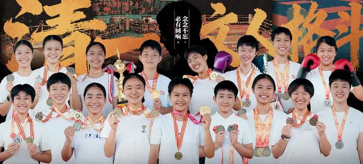

收录于 · 富裕家庭的教育与传承问题研究

乔安娜、许静一 等 324 人赞同了该文章

最近有两个家庭来访，都算是创一代的“有产阶级”，“高端家庭”了吧！家里都有三个孩子！

我问第一个家庭：你肯定很爱孩子，才生了这么多个（3个），那么：你是怎样爱孩子的？你怎样安排和规划孩子的未来的？

家长很迷惑的样子，显然他没有多想这个问题。说他的观点，对孩子就是从小严格要求，长大到18岁就让孩子独立，去上大学，去工作。孩子将来想怎么样发展，就自己决定，他啥都不管了！

听起来很“新教育”。毕竟是跟我学了很长时间的学生，似乎认为在孩子的独立和教育上都是很重视的！

我却笑话他：如果只会这样做的话，跟他原生家庭农村出身的父母有啥不同？他父母就是成功地养出了一个985的优等生，现在会独立谋生，生活得还不错，也挺受尊重的！

他有些傻眼：仔细看看，的确与父母的培养方式没啥不同。甚至他未必会比父母的教育结果更好----孩子要考上超过他的大学，难度还是很高的！

当然，这种要求，总比一些穷家庭出身的家长，富裕之后却把孩子往废物方向培养要好得多！

这父母还算是聪明。马上问我该怎样做？

我说----你看到我是怎样做的吗？我怎样安排我孩子的未来人生规划？

我认为社会很残酷，我真心不忍心，让我的孩子去这个吃人的社会上，一个人苦苦的挣扎，随波逐流。我希望她能活出自己的尊严来，活出自己的自由和地位。

但靠她个人奋斗，她是绝对做不到的！

我可以用钱来装一个保护圈，一个生活舒服的温室，把她藏起来在家里过一辈子（很多有钱人家就是这样做的）。但人不是宠物，这样虽然隔绝了社会的风雨，但会让她失能。最终只会抑郁终身的！

因此，我必须给她创造一个生态圈，一个拥有自由和有尊严的地方，还有社会地位的生态圈。因为没有生态圈的圈子，是活不长久的。

这个生态圈，就是清一公社，就是国礼计划。

清一公社是我们自己的生态圈！国礼计划就是我们送出的，与国王散步的礼物。

如果没有国礼计划的加持，我们的清一公社，就会成为马云一样的过眼云烟！因为再多的财富，也会因为各种原因散掉的。被败掉，或者被抢走！

只有国礼计划的存在，我们才能融入国运。才会让我们的清一家园长治久安！

因此逻辑就很简单了，我给女儿安排的道路，不再是普通人家的【打工仔之路】。而是文化上层之路！

她【最好的命】，就是----自己成为国礼！

她【最差的命】，就是成为国礼的朋友。她如果拥有一批国礼的朋友，其实她这一生，再差也差不到哪去！

这就是我利用我一生的创造，给我孩子安排的未来！让我的孩子生下来就有财富自由，终身不在担心生存问题，她只需要关心“发展问题”。至于我从小教她的“长到18岁就要被赶出去独立生活”，只是一句防止她成为寄生虫和废物的威胁罢了。不是我的安排。

否则我和山上的农民没有两样！

如果你们这些家长对孩子的全部人生规划和安排和努力。就是让孩子不成为寄生虫，能够去打工就好了，我看就是跟你们的父辈对你们的培养方式没啥差别，你没有真正的站起来为孩子铺路！

这家长说：原来你做公主班，有这么长远的打算。但很多人看不懂！

是的。公主班是我为女儿打造的，最美好的人生路径。一般家庭就算拥有几个亿的财富，也都无法打造出来这样的圈子和未来，也无法拥有这样的国礼伙伴。

我把我一生的心血打造的给女儿的礼物，一样无私的分享给这些普通的家庭，可是这些家庭，由于自己家族的业习，看不见这里面的价值，很多家长们还是要让女儿去走普通的打工仔之路，我当然也笑而不语。道不同不相为谋，看不懂，不如大家各走各路吧！

家长有点着急：我们家孩子是男生，他喜欢理工科，不喜欢文科。不太适合走公主班的这条路吧？

我开玩笑说：当不了国礼，当国礼的老公也不错呀？只要会甜言蜜语的说乖话。哄公主们嫁过去，不就成为国礼家庭了？轻松拿走我创造的一切结果！

不过我说这是开玩笑的！男生不能寄希望用婚姻来改变命运，这是赌博。

我就问：你希望孩子学理工科，你想过最好的可能是啥？最差的可能是啥？

他说：只要认真执行，最好的可能，是成为未来的乔布斯，马斯克。最差的可能，就是成为一个普通工程师，打工仔。自食其力。

我说：对的！不过你还可以提升一步。

如果你想要自己的三个男孩子，都走“科技之路”。你最好就像我一样办个【王子班】，搞个科技学堂，倡导【从小爱科学，学科学】。

我这里的学堂教育，是【从小学英雄，做英雄】。将来长大做冠军，做国礼。家长们很喜欢！

你将来做一个类似的愿景，长大后做科学家，不就是家长更欢迎的吗？

就相当于学科技的斯坦福，最终逆袭耶鲁哈佛一样，现在成为新贵，排名都高于传统文科教育为核心的耶鲁哈佛了！

当然你去办科技大学是不可能的，实力和能力都达不到。但你为孩子去创建一个全国最好的科学中学，我认为还是没问题的。毕竟你们两夫妻都是985大学的理工科专业毕业生，这是你们的特长！你自己也超级爱科学。当然可以去做这条路！

我说如果我们家，有喜欢学科学的儿子的话，如果小明慧是男生的话，我可能办的班级，就是“王子班”了！但女生没几个喜欢学科学的，所以：我只能以文科和人学为核心，而不是科技。

虽然我们今日三校的学生，也鼓励她们去学理工科，主要是为了将来的就业考虑的，不是为了人生的长远规划发展！我规划的班级就只有一个---公主班！

公主塾的学生都不是公主班的道路，她们的目标，与今日三校基本相同！只有其中的少数人，才可以加入国礼计划！

如果是你的科技王子班，将来你儿子，最好的道路就是成为未来的乔布斯马斯克，最差的道路就不再是当个工程师，打工仔了。而是可以继承你的家业，成为“培养未来乔布斯马斯克”的学校校长，这不是最理想的道路吗？

这对夫妻茅舍塞顿开，看到了一条光明的大路。当然---要踏踏实实的走下来也不容易！就像公主班的国礼目标，要真的实现起来，也是极难的。需要20年以上的一贯努力。

不过我认为：公主班的国礼计划，只需三五年就成形了！剩下是全球推广的问题了！

另外一个老板，有自己的实体企业的老板，也很兴奋！

说自己家的也是儿子，可以加入这个科技王子计划！

我说：你家孩子，将来成为乔布斯第二当然好。但是：万一成不了，最低路线，你希望他会成为什么？

你甘心让孩子去给别人打工吗？总不可能去当校长吧？

家长语塞了！

我说：你家经商多年，资产较多，家里应该培养一个守护财富的人出来！设法保住你们家改革开放这40年带给你们的成果。

未来很多富裕家庭会【返贫】，我认为你们家庭的首要追求，应该是防止财富流失，而不是教孩子“进取”，时代不一样了。现在让我去创业，我也不会成功了！

我就问他：如果要培养守住财富的后代，最重要的事情是什么？

家长以为是财商，聪明等等！

我说：是“无欲”。

我说我们家也有类似的问题：家族财富的继承，和保值增值的问题！

因此，张明慧从小的教育方向，就是“无欲”，让她对任何物质诱惑，吃喝玩乐都没兴趣。因此，到了18岁来看，基本上是成功了！她对外界物质商品的吸引力感受很弱，去五星级宾馆，去吃高级餐，米其林餐厅或者高级自助餐。她要的东西都很简单。平时的生活也很简单！比我的欲望都低！

因此，我算是培养成功了一个无欲的家庭继承人和财富管理人。这样的人，在公主班还有几个！因为我的财富都会交给这些公主来管理，这几年就已经在交班了。

因此只有无欲的人，才能长远！

【诸葛亮诫子书】说---非淡泊无以明志，非宁静无以致远！

一个淡薄宁静的孩子，才是守成之人！

不过我说：可惜大多数家长不懂这个道理。往往把孩子往纵欲的方向去培养！结果---就只能是家族败落！

家长问：怎么培养无欲呢我说：这就比培养科技人才还难了！要说简单也简单，就是小明慧走过的道路！

要说难：很多人做不到！

因为我们的大多数家庭，有钱了之后，心思都在吃喝玩乐上。自然带出来的孩子就是消费者了！这种孩子败家是最快的！

穷人的孩子，啥都没有，会想办法去创造和付出，无意中成为了经营者。

富人家庭的孩子，往往被家长各种娇宠，带着孩子吃喝玩乐。最终成为了消费者！

家长居然期待这样的孩子成为家族财富的继承者？

真的是笑话！
