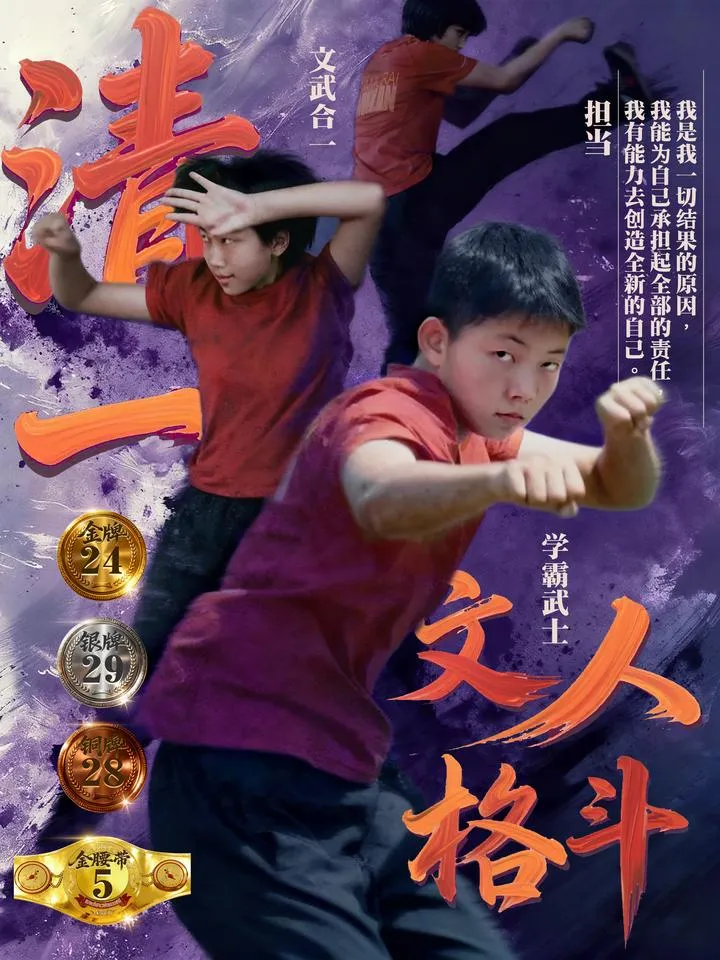
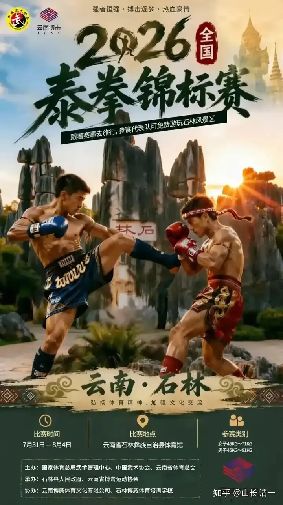
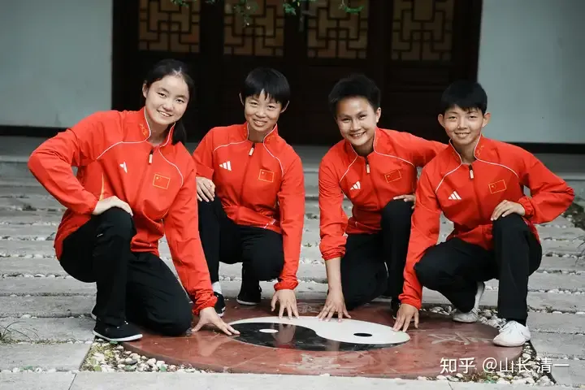

本次全国锦标赛，是第一次在云南举办！这次赛事，也是年底在沙特举办亚洲室内运动会和武道运动会的选拔赛，也是明年泰拳世界锦标赛的预选赛！所以基本上全国的高手全都来了！

清一战队本次也派出了目前的最强阵容参赛，仅仅女生，就参与了6个级别的赛事！去年武汉的全国锦标赛，我们女生参加了四个级别的赛事，拿到了全部的四块金牌（四块银牌）。四个公主以绝对优势，获取了今年参加世界锦标赛的国家队资格。

今年女生们会保住去年的四块金牌呢? 还是有可能再进一步？多拿一点金牌？还有希望拿到全部参加项目的六块金牌吗？

1：今年的45公斤，派出的夺冠擂主是谭木兰。我想她应该能够毫无悬念的拿下这个入门证的。这块金牌基本上是稳的，我相信谭木兰的老成持重。她被压制的太久，早就该走上世界锦标赛的舞台了。这个级别，我方吃素的队伍，拥有绝对的优势。金银铜牌应该都能锁定。

2：今年的48公斤，公主班有三个公主都参加赛事，去年的青年组冠军王静恩，将是今年的夺冠热门。而世锦赛的李级别想公主，今年主动选择了退出，把参赛机会让给其他的公主伙伴！反应了清一战队在储备人才上的厚度。她们将要遇到的对手，其中有一个是2025年的东亚锦标赛冠军，也是这次刚刚参加完世界锦标赛的香港拳手。这位香港拳手，在ELLA公主2023年首次参加全国锦标赛的时候，就被ELLA刚刚出山的小粉拳击败，这次在马来西亚见到ELLA，还有点颇不服气的样子。不过ELLA也不会去计较这些人的态度，香港队根本不是她关心的对手，ELLA只关心如何击败俄罗斯人。这位傲气的香港拳手，今年遇到三位公主伙伴，会得到怎样的待遇呢？另外一个拳手，原来锦标赛公主们已经打过比赛，被击败了。据说现在正在泰国苦练泰拳，想要复仇成功！不知道结果如何！

48公斤级别，全都是新公主来守擂台，老木兰都有意退开了。对手也都是现代格斗的全国汇聚的佼佼者，她们能守住这个阵容吗（原来这个核心的阵地，是刘晓慧，谭木兰，ELLA的舞台。她们让出来的空缺，公主们能补充上来不？）

3：今年的51公斤级，ELLA公主也主动退出竞争了！她要把冠军，还给去年为她让赛的林佳慧。参加这个级别竞争的其他对手，就是拿过多次全国自由搏击和泰拳的冠军，也参加过自由搏击和泰拳世界锦标赛，世界运动会的耿春蕾。她和我们的拳手最近几年打了6次，抢走了世锦赛和世界运动会的名额。今年她还能如愿吗？鄢佳彦主动从45公斤升级来参赛该级别，就是想找机会和耿春雷过过招。耿是从60公斤降重来打的比赛。45公斤的人打60公斤的人，有点玄乎吧？还有一个刚满18岁，去年拿了青年全国冠军的新公主，也要和这些职业拳手比比高低。

本级别还有今年的新晋自由搏击冠军，击败耿春蕾的一名国内高手，昆仑决和职业赛的常客，也去泰国仑披尼打过比赛，深圳盛力人和的签约拳手。也就是原来世界冠军邹世民的老东家。这个战队是中国格斗界具有很强实力的一个俱乐部。林佳慧今年在这个级别遇到的对手都很强，她能守住这个级别吗？

4：今年的54公斤级别，陆鸽也退出了竞争。她想把捍卫这个级别的机会，让给新加入的公主们去打。陆运如是这个级别的夺冠热门，总共两位公主和一个冠军班的女生，将和两位外家拳高手一起，争夺这个级别难得的世界锦标赛名额。

5：57公斤级，我们原来是无人参赛的。因为我们的太轻了！这次Ella公主和陆鸽一起升重报名参加这一大级别的竞争。等于ELLA从自己原来的51公斤级，连升两级，到57公斤打比赛。对手将会是从65公斤降级来参加赛事的天才少女应越。自从去年在她的家乡武汉被陆鸽客场击败后，好强的她不甘心失败。特别去泰国强化训练了几个月，这次是卷土重来，要再次和陆鸽比一次。她特别反省了上次打完两局就退赛的TKO结局，她没有坚持下来是违背了拳手的顽强精神。这一次她说一定要坚持打完三局。ELLA公主也很高兴这次有机会和应越交手，正好她两比比看，谁才是天才少女拳手。

6：60公斤级，我们有两名冠军班的女拳手参赛。不过---只练了2年的她们，大概率很难击败外家拳对手，可能难以拿下这枚金牌。混个银牌铜牌也行吧！

2025年全国泰拳锦标赛四个级别的公主冠军们 世锦赛国家队队员

根据我的判断，目前清一战队具有ELLA类似实力的拳手总共有8位。ELLA更谦虚一点，说有10个人都不比她差。其中包括两位男拳手！

这些人应该都能为国争光。不过：是骡子是马，还是要上赛场上来溜溜！

我们的孩子都很年轻，正在快速的成长，因此大家都不急，轮流上世界锦标赛吧！中华格斗第一战队正在奔涌出来。
