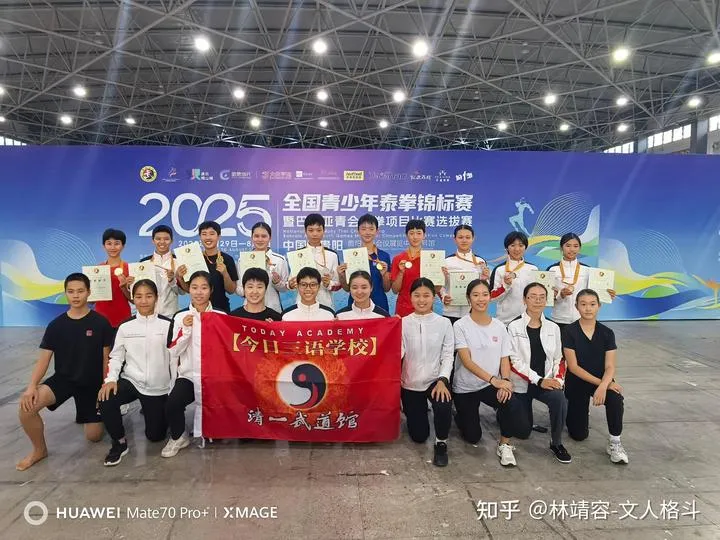

收录于 · 清一太极武术理论与实践

乔安娜、常清杰 等 135 人赞同了该文章

中国武术套路表演，其实是【艺术体操】的变种。

【男子太极拳 第1 2 3名 2021年全国武术套路锦标赛 太极拳】

2021年全国武术套路锦标赛 太极拳www.bilibili.com/video/BV1F3411f78B/?share_source=copy_web&vd_source=c9367a1b487fa1b7224367d6e4b00256

【2025年太极拳锦标赛 第1名 北京 杨瑾 9.700分 】

2025年全国太极拳锦标赛 女子太极拳www.bilibili.com/video/BV1ivfiB3EGv/?share_source=copy_web&vd_source=c9367a1b487fa1b7224367d6e4b00256

这两个视频，都是太极冠军的表演。男和女！

但：用我的观点来看，这不是太极拳，这是艺术体操！

因为一：根本看不出任何实战能力。不是拳，只是舞！

我担保这些冠军们毫无实战能力，我这里练过一年的年轻人，都可以把她们这些练了多年的“全国冠军”轻松打翻！但这些练了一年的年轻人，面对我们练了三年的公主拳手，只能是菜鸟。无论男女，都打不赢公主拳手！因为这种太极拳，完全没有蓄力发力的动作。真太极，练起来的时候是藏着的，就是随时可以发力的，出出在蓄力，就像猫一样：随时可以跳起来攻击！

二：这种太极练习的难度巨大，比实战太极难得多！

实话说：让我和我们的清一战队的公主去练这种套路，真的练不出来。难度太大了！真的是体操的难度！练起来的辛苦程度，一点也不亚于我们连实战太极！

三：这种太极伤身，不养生！对身体是有损害的！

这种太极的特点，是缓慢的移动，保持姿势很低，也很僵的状态，肌肉的压力很大，膝盖的压力也很大！特别是一些特技动作，跳起来旋转360度后，单脚落地还要站稳。这比体操要求都高。长期这样练，腿肯定要出问题！

怪不得：太极拳的裁判们，一旦脱离了运动员的身份，都不练太极了！

中国想要把这样的中华武术推向世界，想要进入奥运会？难度真的好高！我看就没啥人想学的。

起码我是不想学的，我也学不会！

就算学会了，也没用---1是不能实战，2也不能养身，还容易受伤。我练这东西干嘛？找个饭碗，继续去骗下一代人吗？

无意中看到了一个资料：

发现中华武术， 真的是来自于体操、来自于西方的体操教练的指导和帮助！

怪不得===与传统套路相比，国标套路差距真的巨大！

后期的各种中华武术套路，应该都是 这样来改造的。改得连妈都不认识了！

而且---传统套路也向国家标准看看齐。没有人练单招了。导致现在的传武基本上失传了！

转文；1953年苏联艺术体操团访华；1954—1956年多位苏联体育、芭蕾专家（代表：生理专家柏钦柯、芭蕾形体教练）深度参与武术改造：- 竞技套路：明确改革方向参照苏联自由体操，引入大开大合舒展造型、控腿、腾空跳、标准化亮相，弱化传统实战寸劲、近身攻防；- 24式简化太极拳：苏联运动生理学专家参与测试论证，把传统太极改成健身体操（俗称太极操），删减复杂技击内容；- 训练体系：照搬苏联体操基本功（芭蕾压腿、形体站姿、成套分段口令教学），武术从此和体操共用一套形体审美、打分逻辑。
