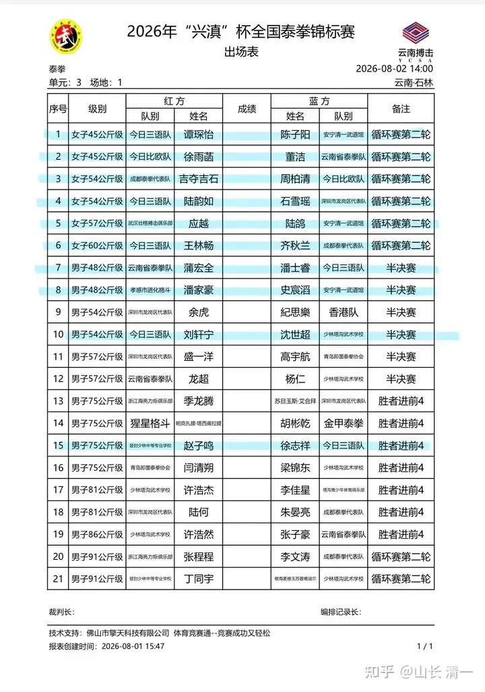
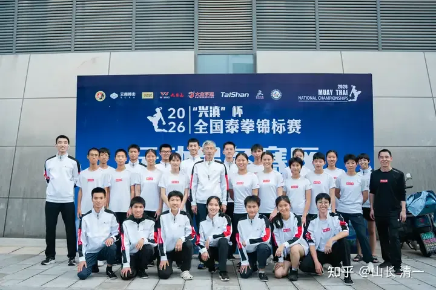
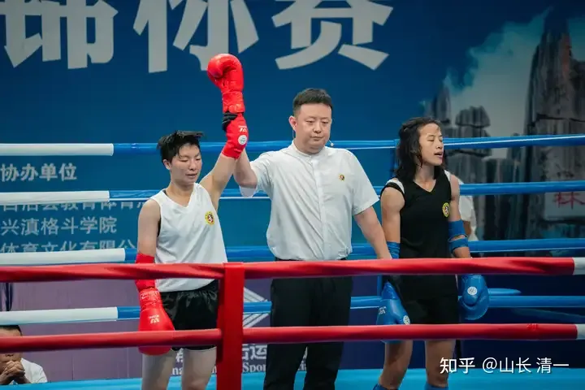
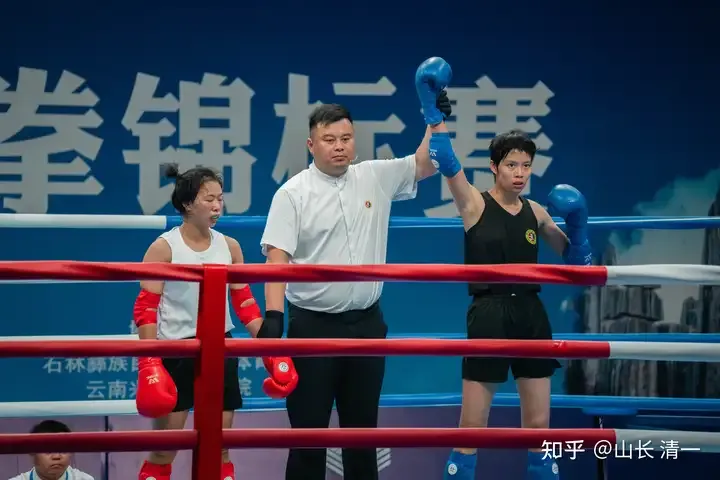
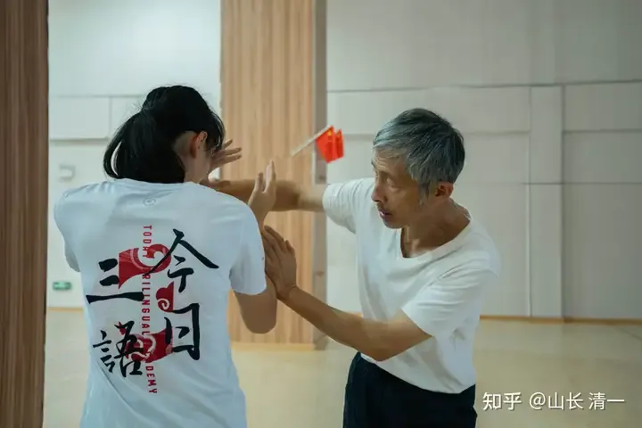
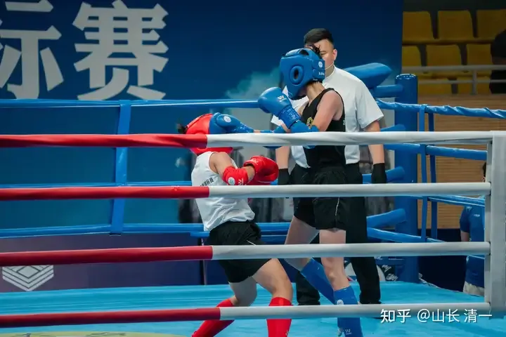
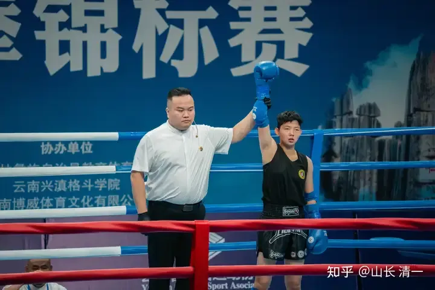
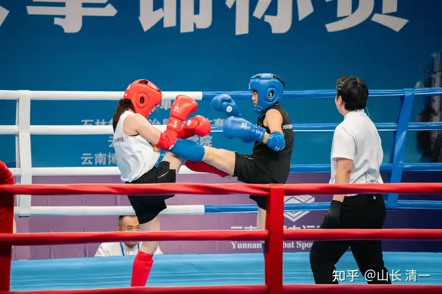

收录于 · 清一太极武术理论与实践

乔安娜、常清杰 等 233 人赞同了该文章

这是明天的赛事表格！蓝色标记的都是清一派拳手参加的比赛，多达一半的场次！

今日是男子专属比赛，我们的场面就衰落了很多。

今天黄武士击败了少林塔沟武校的对手，顺利晋级半决赛！

昨天，开赛首日：我们的队员也有11场比赛，9女2男，也超过一半了（一天是20场比赛）。

都超过了赛事总记录的一半！可以说我们的队伍真的很强大。几乎肯定是全国俱乐部中人数最多的队伍了！

相比一些队伍，比如武汉队只有一个队员。队员就是明天的重头戏赛事----陆鸽和天才少女应越的二番战！应越队去年第二局落后弃权表示不甘心，今年要重新来打过。果然两人就再次遇见了！只是双方都从去年的54公斤级升到了57公斤级。去年应越是从65公斤降下来打的比赛，今年可能实在降不下来了！至于陆鸽，体重其实没有增加，吃素的很难长胖。只是喜欢打重一点的级别来锻炼自己！

决赛日这天，8月4日，应越还要面对从51公斤升级来打57公斤的ELLA公主的冲击！她真的能连过两关，拿到这个项目的金牌吗？我看有点困难！上次她拒绝领取铜牌（是同伴代领的），这次她能升级吗？或者还是只能拿铜牌？其实拿铜牌也不错了。总比连续三届的全国冠军耿春蕾幸运多了。她这次首轮就战败被Ko，连铜牌都没有！

另外一个看点， 就是45公斤级昨天被陈子阳KO的董洁，记得昨天是抬下场去的！居然明天还会继续参赛吗？她没有弃权呀？我真的佩服这些现代格斗拳手的斗志，真的好顽强。和我们的拳手温吞吞的相比，按了重拳就弃赛，这些外面卷到顶的拳手，实在是强悍多了！

不过陈子阳今天要面对谭木兰的比赛。虽然她决心要无畏地挑战强者，但谭木兰应该根本不会给她挑战的机会。大家就比较一下明天陈子阳面对同门师姐，就算拼命也打不出啥结果来的！而且我相信谭木兰会收手，不会让陈子阳去坐担架。但结局几乎是注定的---会是TKO读秒结束的！不太可能打满三局。

我猜谭木兰的所有三场比赛，都会提前结束，国内还不太可能有人能够跟她打满三局的。她积累了五年以上的太极实战的战力，将是普通的现代格斗拳手这辈子再也赶不上的距离！太极十年不出门，太极五年难下手。

如果董洁有机会对上谭木兰，她会感觉与陈子阳相比完全不是一个级别的，下不了手了。

木兰蔡凯棋再给她们几个人拿靶训练的时候，认为陈子阳的拳腿都软绵绵的。可是谭木兰和佳慧的拳腿打上来，就是沉重被虐的感觉！所以---我个人认为董洁对阵谭木兰的时候，及时退赛会比较明智！

54公斤级的两位外家拳手，明日将继续和我们的公主拳手对阵，如果两位拳手继续输掉明天的比赛的话，冠亚军就将在两位公主之间竞争了！

然后决赛日的时候，这两位明天输掉的拳手，继续去打争夺三四名的赛事！因为是循环赛。

【好像我太乐观了，但我相信她们两天之内，是想不出对付公主的有效方案的！只能换个人继续虐。不过这两人真的耐打，被击中这么多腿都能坚持打满三局。或者是长腿公主们的腿太粉了一点？】

本次参加全国锦标赛的清一派拳手

下面是昨天的部分赛事照片

51公斤级，佳慧淘汰对手进入四强。

54公斤级：陆韵如击败对手（藏族）

我在运动员准备室，教ELLA怎样破对方的曲臂防守

本来打45公斤级的木兰佳彦越级挑战51公斤，KO了耿春蕾。

标志性的攻击动作
