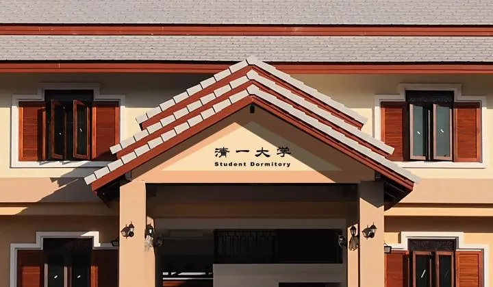
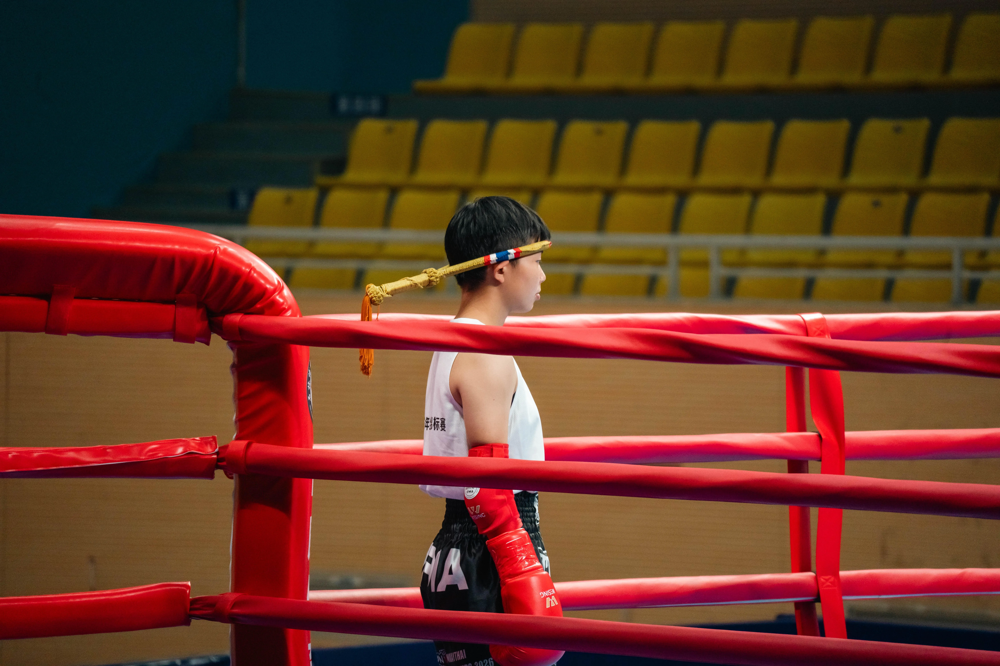
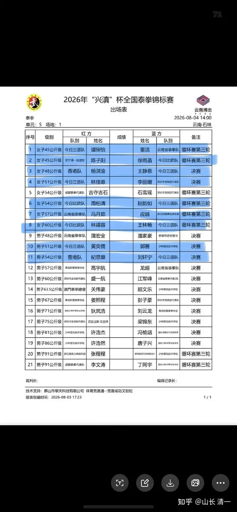
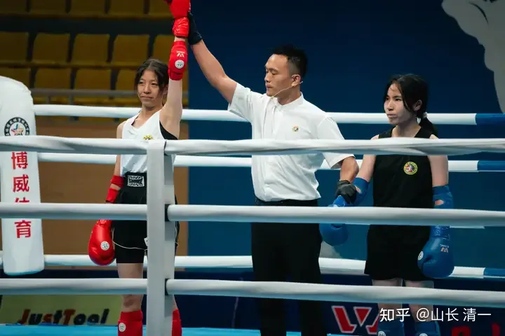
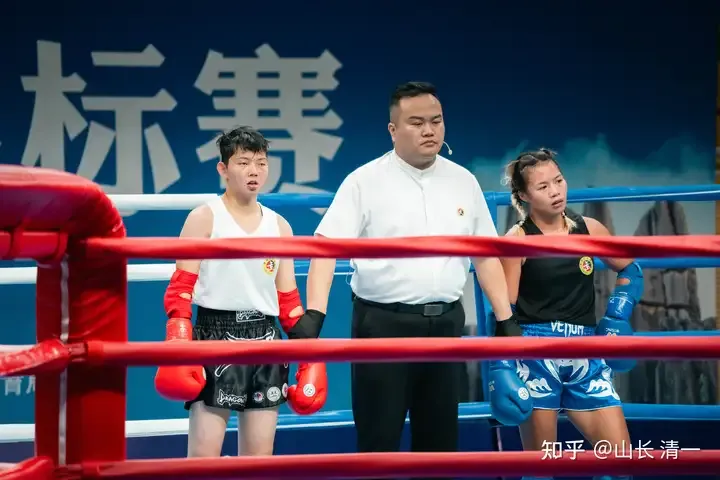
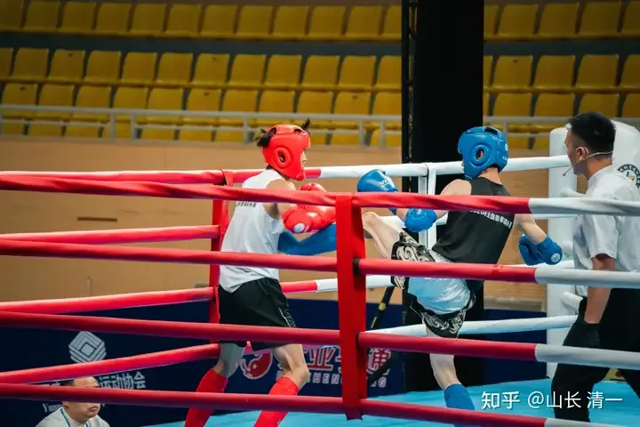
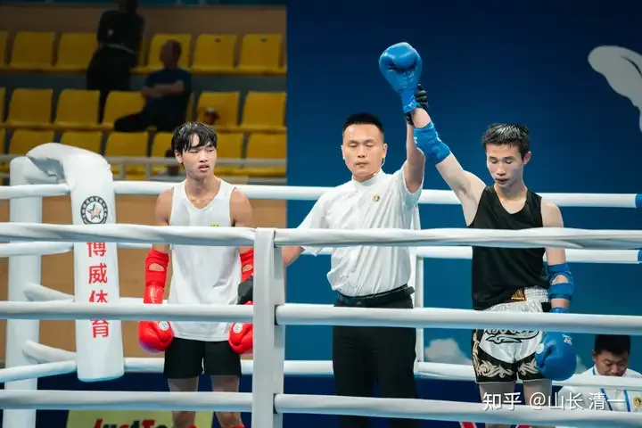

昨日赛事记录

清一大学武医学院的文章 - 知乎

今天的决赛日程表：清一战队又是拥有半壁江山，共有9场比赛。虽然遭到了不太公正的待遇，但我们还是拿到了8个级别的决赛权（六女两男）。就是说：就算是今天我们的比赛全部输掉的话，我们至少也有8块银牌！也算是辉煌战绩了。

其中我们在七个级别，都要和外家拳手对战，拥有七个夺金的机会。目前我们已经内部锁定了一块金牌！从今天的结果来看，我们已经拥有武林的半壁江山。目前清一战队和历史悠久，创校几十年来一直为中国武术领域贡献各级格斗冠军的少林塔沟武校的队伍，拥有差不多人数的决赛资格。

不过少林塔沟武校，是4万人的专业武术学校，我们区区不到四百人的文科学校，总共就只有几十个学生业余练武。最终就和规模超过我们一百倍的专业武校，能打个不相上下的结果，这不能不说是老祖宗传下来的功夫好，加持了我们这些队员！才能走这么远。

男子的两场半决赛，51公斤级的刘轩宁不负众望，以首回合KO的战绩，击败了夺冠热门---塔沟武校的强劲对手晋级决赛。因为赛前他听到小道消息说：塔沟武校的这个拳手，是总教练看好的苗子。他就知道---如果打满三局，大概率是会被判负的。所以吓得刘轩宁只好使劲输出，首回合就用膝击重创对手，三次读秒导致对手TKO结束比赛，顺利拿到了出线权。今天他将和香港队的拳手，东亚泰拳锦标赛的冠军争夺冠亚军。

黄武士昨天半决赛的对手，是重庆队的高手秦昊。这个拳手的身高和体重都明显比黄武士大一圈。但黄武士依靠灵便的步子，连续拳的攻击，以及内围战的优势，给了对方大量的打击，以3:0的明显优势拿下了半决赛。今天黄武士会遇到更加强烈的挑战：将要和塔沟武校的郭赛争夺冠亚军！这肯定是一场恶战。

今天决赛日的首场比赛，是谭木兰要打的45公斤比赛。我认为持续的时间会很短，正常情况下，谭木兰将在第一局就结束战斗！这样的话，45公斤的金银铜牌，都会被我们拿下来。对手虽然有主场之利（她是主办方的代表拳手），我相信谭木兰今天会送给她收获两次被Ko的战绩（首战她很意外的被陈子阳Ko了）。这个拳手第一局冲的很猛，但体能太差，第二局体能就会崩了。。。。

前两场跟伙伴比赛，一直很温柔，含而不发的谭木兰，明天面对外敌的决战，会爆发怎样的攻击力呢。昨晚我去看了孩子们，她说她计划以攻对攻，不跟对手啰嗦，首局就拉满战力，KO掉对手！我就威胁她说：明天假如丢了比赛，要被处罚的，她就走路回恒大算了。不过，我怕跟她住在一起的ELLA公主听了这个要求，压力太大。就安慰ELLA说：她明天输了与应越的比赛也没关系，毕竟陆鸽师姐也被判输了！[表情]。

48公斤王静恩半决赛取胜后，将面对东亚锦标赛冠军的决赛！

本次48公斤的比赛，将在香港拳手和公主王静恩中决出。这位香港拳手，2023年还是香港冠军的时候，就和ELLA公主交过手，被ELLA的连续进攻小粉拳给击败了！这几年肯定还是有进步的，她后来拿到了东亚锦标赛冠军。今年也代表香港去参加了世界锦标赛，不过据说首轮就被淘汰了，没有拿到奖牌。击败她的ELLA都只能拿铜牌，她零收获也算正常吧。看静恩公主能否成功击败香港拳手，拿到明年世界锦标赛的出战权了。

本次锦标赛，初赛的时候香港拳手是遇到了雨菲公主的。我认为明明是雨菲公主胜了，但结果是判给了香港拳手。害得雨菲公主首轮就被淘汰，连一块铜牌都没拿到。不过香港拳手远来是客，既然没被KO，按照缅甸拳的规矩，双方就是平手。判给谁都行吧！无所谓。雨菲公主表示回去要继续苦练KO的功夫，不把裁判胜负的权利交给裁判。

昨天这位香港拳手在半决赛中，又打满三局，再次“战胜了中国拳手”，进入了决赛。那么，今天的决赛，香港拳手还会有这么好的运气吗？她能拿到该级别的冠军吗？静恩公主会让她顺利过关吗？等待下午比赛的结果好了。

51公斤级的比赛，将在林佳慧和逃跑将军---昆仑决职业拳手，自由搏击冠军李丽珊之间决出胜负！昨天半决赛51公斤木兰佳彦的比赛，全场三局，都是追着对手打。对手根本没有啥有效的攻击，相反外围内围都被佳彦打击。对手的策略，就是尽量避免攻击，脱离战斗，希望打满三局让裁判帮忙取胜吧？果然她成功了，逃避了三局，拿到了“胜利”的结果。但“胜利者”是被打击到弯着腰，被队友扶出去的。而败方佳彦，是毫发无伤，雄赳赳地走出场外的。这种“胜利”，也实在有点夸张！

逃跑高手的胜利，实在来之不易

不过别人看不懂我们就算了，我们继续强化训练。昨天下午和晚上，预判了我们的对手都会采取一样的逃跑方式来回避我们的公主们的打击，公主们就开始讨论用新的方法来对付这种赖皮战术了。有趣的是：来自不同俱乐部的对手们，自动组织了【外家拳联盟】，一起来商量怎样对付我们。而且还有啦啦队互相帮助，清一木兰正在对战【外家拳全联盟】。这位逃跑高手，今天决赛，将面对木兰佳慧的冲击，她还能逃跑成功吗？。

54公斤级的比赛，今天的两场比赛，都是“垃圾时间”。因为无论两场比赛是啥结果，都不太会影响金牌的归宿清一战队。两位外家拳手都已经被公主们击败了。上轮比赛中，国内职业格斗最强的深圳龙岗战队石雪瑶，在韵如公主面前，只站了20多秒，就被击倒退赛了！她今天就算击败了成都战队的对手，也只能拿到银牌。如果她输了的话，算小分她有可能失去银牌。这个银牌其实是被我们的马大哈公主周柏青主动丢掉的。上一轮，她居然忘了自己还有比赛，导致失格，丢失了比赛机会。闹出了清一战队参赛以来的“新纪录”。我相信大家都会记住这种不应该出现的失误。

57公斤级的决赛，将在ELLA公主和应越之间举行。不过由于ELLA公主之前让赛陆鸽，因此就算本次比赛赢了，可能也无缘拿到冠军，因为三个拳手都是一胜一负。到底判谁赢？就有点不好说了！我让她别纠结比赛的最终结果，她作为拳手，只管打好自己的比赛就行了。谁当冠军就让裁判们自己决定去！当然，如果ELLA没法KO对手的话，估计打满三局，还是有可能输掉的！

60公斤级别的比赛，是练拳仅仅两年，毫无战场经验的王林畅对战沙场老将齐秋兰。在第一局处理不好情况，被裁判读秒判负的情况下，王林畅开启了反杀模式，面对比自己重得多的对手（她的真实体重才57公斤，升重来打的），第二局扳回了比赛。第三局杀得对手更是溃不成军，体能全崩了。不过虽然王林畅后面两局表现不错，由于第一局的扣分太多，最终失去了夺取金牌的机会！她今天的这一场比赛，就算是赢了，也只能拿银牌了！不过，由于出身冠军班，王林畅本应打完这次比赛后，就去申请读大学的。但因本次比赛表现出的决心和毅力，在最不利的环境下能够反杀对手，在技术不全面的情况下也弄到对手毫无办法，因次王林畅得到了加入清一公主战队一年继续集训的机会。如果她在未来一年内表现良好，就可以有机会，升级直读清一大学武道专业研究生了！这是目前三语冠军班，唯一一个拥有修习武道专业机会的女生！

总结：本次全国锦标赛，我们参与了全部女子项目的六个级别比赛。目前都已经进入决赛，最差的成绩都至少能够锁定六块银牌。这种女队员拥有的全面优势，全国再也没有第二家了！我们现在，已经是全国最强女子集体战队！而且后续新队员源源不穷，老队员每年都在更新提升作战水平。三年后，这批清一公主女子战队，将是为中国跻身世界格斗三强的最核心力量。三年后，必将出现能够击败世界锦标赛男子冠军的女子，改写世界格斗历史！大家一起加油！

男子级别，我们也有两名拳手杀进了决赛。51公斤和54公斤级别。

男子51公斤级半决赛。黄武士击败对手获胜

男子54公斤级，刘轩宁在半决赛中TKO击败了塔沟武校的对手获胜，今日将与香港拳手争夺冠亚军！

今天的决赛比赛，将是历史上最剧烈的一天：清一战队的主力队员，将要集体面对外家拳手的充分考验！不过，就算是全部都失败了，我们至少也有8块银牌！也算创历史记录了！哈哈
