2026泰拳全国锦标赛决赛日：

昨天8月4日，是全国泰拳锦标赛的决赛日。总共21场比赛里面，清一战队打入了决赛日的9场比赛。而且九场全胜，登顶全国第一。出山全国锦标赛三年，战绩就超越了全国众多的武术专业学校和大学。

其中两场是【内战】，胜负都是自己人。但其他7场比赛，是要面对外家拳手的严格考验！昨天的决赛现场拼杀也格外的剧烈。两场比赛，我方以KO对手为结束。包括一场是男拳手黄武士ko了塔沟武校的优秀对手。这个对手一天前半决赛中，勇猛无敌的KO了对手，晋级决赛。后续也有好几场比赛，双方的比分交替上升，往往第三局才最终锁定胜局。

最终，我们拿下了所有的9场比赛，全部取胜！打出了场上最强的声势。最终获得了

🏅金牌6枚

🥈银牌3枚

🥉铜牌7枚

获得总奖牌为16枚，排名全国第一。

另外两个金牌集体第二三名，是少林塔沟队和深圳龙岗队。下面是央视新闻的报道：（央视报道我们七块金牌，应该是把ELLA击败应越的这块拿回来了）。两个队加在一起的金牌数，总奖牌数量，都赶不上我们一个队的成绩。看起来今日就是断代的第一名。

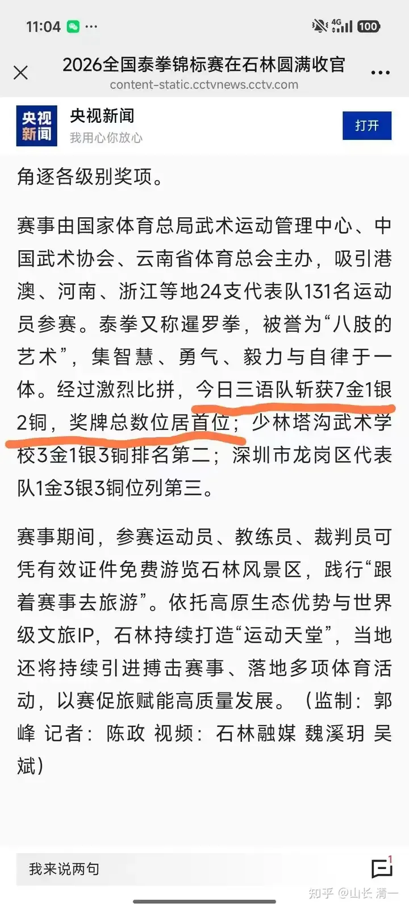

对比去年，2025年全国泰拳锦标赛，清一战队的战绩是

🏅金牌6枚

🥈银牌4枚

🥉铜牌3枚

总奖牌数13枚，首次跻身全国集体第一名！显然今年我们在竞争比去年更加激烈的环境下，比去年提升了一大步！对比一下2025年获得集体5枚金牌，排名第二的江南某省的队，本次2026年锦标赛就只取得了一块金牌。很难得的，首次真正地超过了中国第一格斗武校塔沟武校队。

【去年的塔沟武校队，加上实际上是塔沟武校队员的武汉体院队，如果把两队的成绩加在一起，应该是超过今日战队6块金牌的】

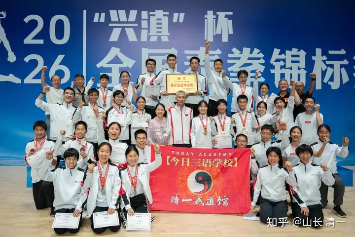

清一战队全体成员

我自己都没有想到，孩子们会打得这么好。可能是前几天，看到了我们的队员被区别对待，大家都知道：如果与对手打不出明显的差距，是不可能取胜的！大家决赛都憋了一口气，所有的参赛队员都全力以赴，打出了自己的精彩。结果就是拿下了所有的比赛！

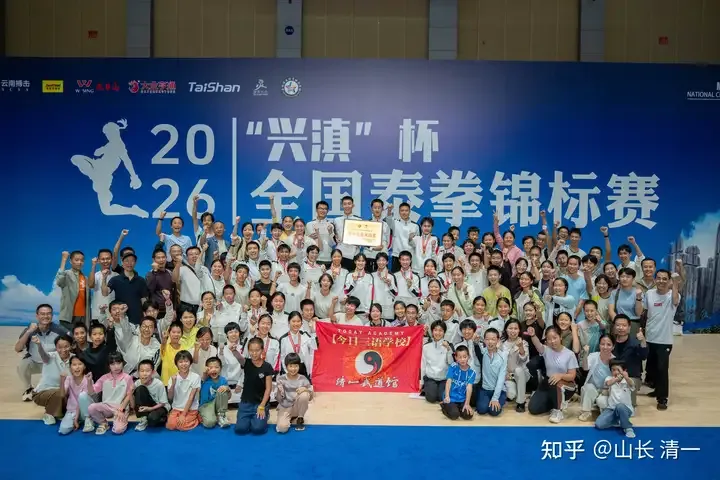

清一战队和粉丝团全体合影---赛场上最庞大的队伍

昨天9场比赛中，七场是面对来自全国的高手，包括实力强劲的东亚强手--香港的拳手（东亚锦标赛冠军）。当然，也意味着：我们拥有七个夺金的机会。

实际结果，是令人震惊的结果：

我们的拳手，今天拿下了今日决赛日我们参加的所有9场比赛。我们成功地以具有非常明显的场上优势，击败了七个级别的所有外家拳对手。让现场的所有人包括我自己都感到震惊，我们都看到了让人无法忽略的清一战队的战力，看到了文人格斗的潜力。这也彻底刷新了中国武术界对传武，对文人的认知。

不过---虽然击败了全部七个级别的7名对手，但我们只拿到了6枚金牌。

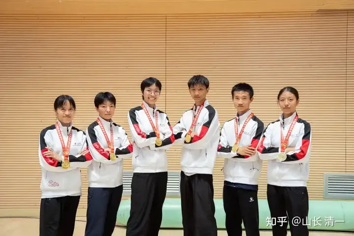

本次锦标赛六个金牌拳手，她们将会预选进入2027世锦赛国家队

我们本应该拿到8枚的。如果60公斤级的王林畅第一局，不要这么不小心被读秒扣分的话！

我们实际打下来了7个级别的第一名。因为我们击败了七个级别的所有对手。

只拿到六块金牌，是因为57公斤级别的金牌拳手应越，虽然在决赛中败给了ELLA公主。但ELLA因为让赛师姐，被处罚了，只给她授予了一块非常宝贵的，创造了世界拳台历史记录的“铜牌”！

也许将来，再也没有人能突破她这个奇特的记录了。

我认为这是一块最有历史价值和意义的铜牌。是一块值得骄傲的铜牌---因为这块铜牌，是奖励她首战第一回合中击败了银牌拳手---师姐陆鸽。但她第二回合就主动退赛，她把最后的胜利的机会，让给了师姐。因此是不计名利，不愿意内斗，是美德的嘉奖。

这块铜牌也是实力的嘉奖。因此后续赛事中，陆鸽意外地判输了，但依照我们的眼睛和判断力，我们没有认为陆鸽输了。不断逃跑和挨打的应越，最终“赢”了师姐！也让ELLA的让赛行为增加了更多的不缺定性。

为了捍卫团队的荣誉，ELLA继续征战赛场（循环赛）第三轮中，在决赛日成功地以3:0击败了金牌拳手应越（30比27），让天才少女不得不狼狈逃串的格斗实力！

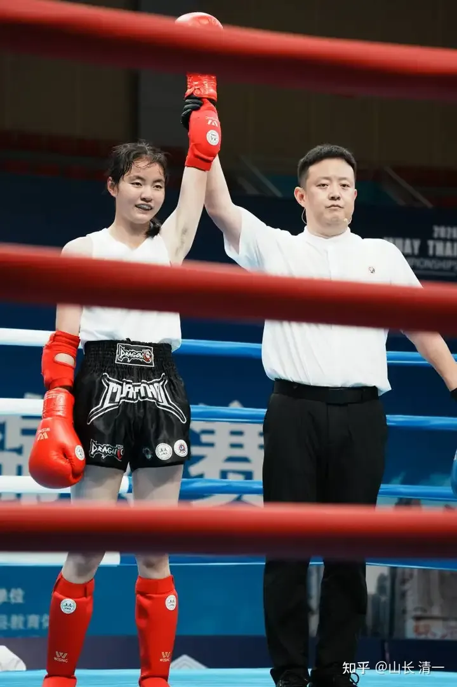

铜牌比金牌的价值更高

可能全世界都没有这么纠结好玩的铜牌了----因为拿到金牌的拳手，居然惨败在铜牌的手下。

因此，这是ELLA公主的荣誉，而不是耻辱！

今天赛场上，ELLA公主敢打敢拼，自己从51公斤，升级到57公斤比赛。勇敢地去面对一个比自己重10公斤的对手，还成功地，毫无质疑地击败了这个对手。

因为对手是从60多公斤降级来打比赛的昆仑决职业拳手，还击败过伊朗的世界冠军的天才少女应越。

我不知道应越今天拿回这块金牌后，会非常珍惜这块金牌呢？还是非常不喜欢这块金牌。只想把它藏起来！

但我认为：我们今日系所有的人，都会非常欣赏和赞美ELLA公主得到的这块铜牌。因为ELLA用这块铜牌，首先是表达了对师姐尊重的美德。

她也用这块铜牌，表达了对金牌拳手实力的嘲弄和不在意！

我们真的不在乎奖牌：但我们在乎我们对宇宙表达的真实身份！我们在乎自己是否拥有了真正的冠军的实力。

我相信所有的人，都相信ELLA公主才是真正的冠军。而且是跨级别的冠军！无论别人怎么给ELLA挂标签，但---我们和ELLA公主都知道：她是真正的冠军！

下面，我们通过颁奖典礼照片，来回顾昨日的赛场

第一场决赛：45公斤谭木兰夺冠，取得入选2027年世界锦标赛中国国家队入选资格。2025年的全国冠军是木兰鄢佳彦，也是世锦赛成员。今年她连跳两级，升重去打51公斤级，首战击溃了耿春蕾，获得今年的铜牌。

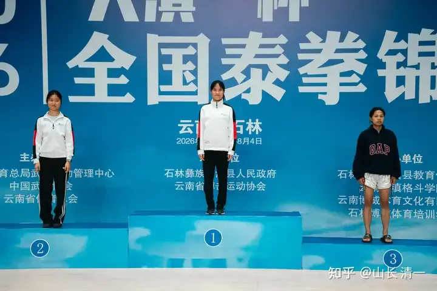

右边的黑衣对手董洁，被左边两位白衣拳手KO了两次。同情中！

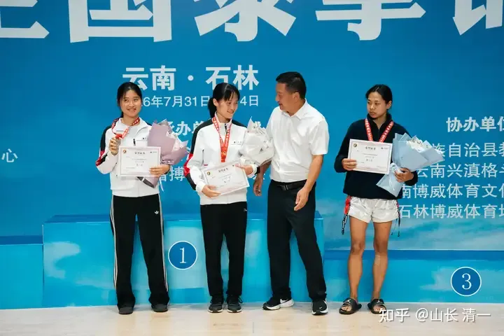

云南省颁奖领导对广东籍冠军很友好，“冷落”了旁边黑衣的云南队本土籍拳手

第二场决赛：48公斤，是刚满18岁的小公主王静恩，击败香港的职业拳手，东亚锦标赛冠军杨淇瑜，获冠军资格，即将入选2027年国家队。

2025年的全国冠军是清一战队的李想公主，她也是2026年的国家队成员，今年已经参赛世锦赛！今年未参加全国赛，因为要给其他伙伴让位置。

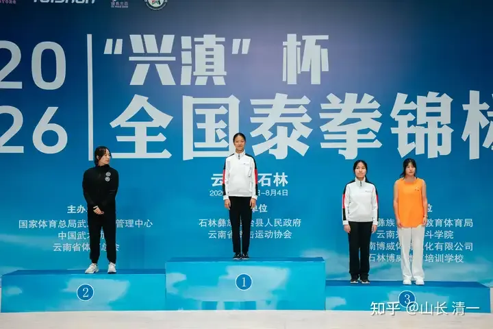

左一的亚军是香港黑衣拳手杨淇瑜。2023年全国锦标赛与ELLA公主交过手，败给了刚出道的ELLA

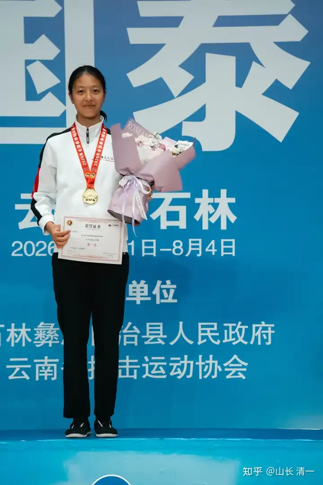

静恩公主刚满18岁，就夺取全国金牌并晋级国家队。

3：女子51公斤级：木兰林佳慧击败资深昆仑决拳手，三届自由搏击全国冠军李丽珊，获得冠军，入选2027年国家队。

2025年该级别的冠军是ELLA公主，她也是2026年世界锦标赛的中国国家队队员。她今年特别让赛其他公主，主动升重两级，去跨级打57公斤级，并在决赛日击败了该级别冠军应越，获取“季军”。但我认为她作为锦标赛的种子选手，不会失去2027年的世锦赛资格，就看她打什么级别了。

该级别连续三届的全国泰拳和自由搏击双料冠军耿春蕾，首战被木兰鄢佳彦TKO击败，无缘四强。挺可惜的！

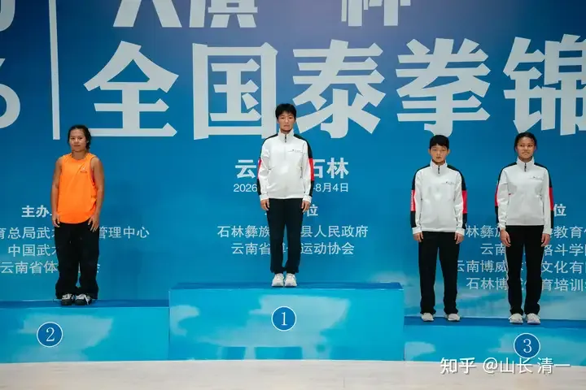

多年冠军李丽姗只能站在亚军位置上，应该很不适应。

4：女子54公斤级 公主陆韵如分别击败三个对手，获冠军，取得入选2027年泰拳国家队资格。

2025年的该级别冠军是木兰陆鸽，2026国家泰拳队的成员！今年她让赛该级别，自己升重去打57公斤级，并拿到了亚军！（实际上她和ELLA都应该是冠军）

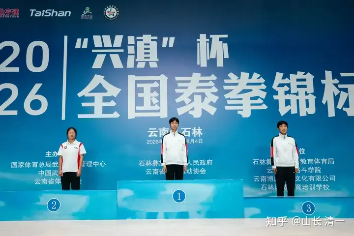

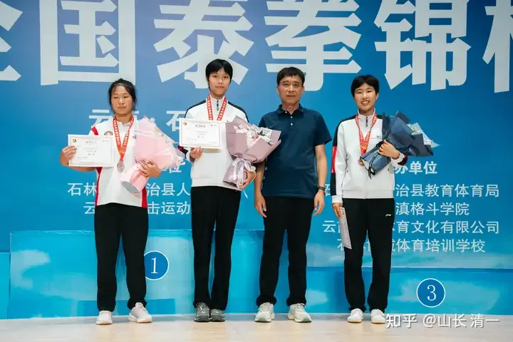

5：女子57公斤级 ELLA公主击败冠军应越，获得比冠军更强的季军！

这可能是本次锦标赛最搞笑的排名了！其实这三人里面，实力最强的是陆鸽，各位可以去看她和应越打的实战录像，看谁更强！

但表现最好的肯定是ELLA公主。她在决赛日第二局，就把应越的体能打崩了。面对比自己重10公斤的对手，她丝毫不显下风。后来应越一直在躲闪，逃避被KO的命运，最终被ELLA公主击败。ELLA公主下来之后的反省是：她处理一些细节还很不好，不然已经ko应越了。她希望明年有机会，再和应越打一次。因为没觉得这个天下少女有多硬的。

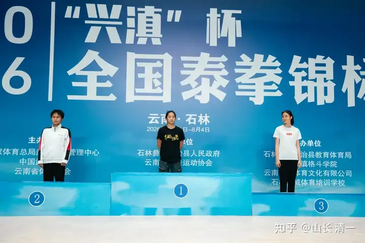

颁奖的时候，ELLA看向应越，是不是想问她：明年--还约不约？

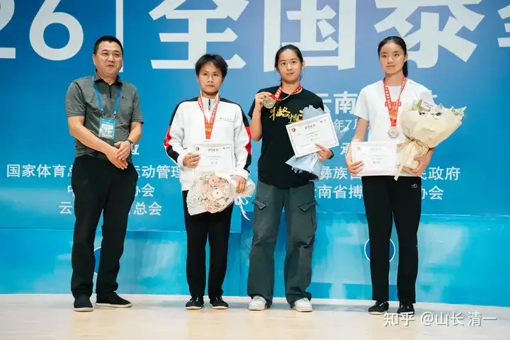

颁奖者是云南省搏击协会会长赵峰。我看他也觉得这个级别的颁奖很搞笑的样子。

女子60公斤级，公主和木兰都没有人参加，因为我们没有这么重的公主。就只有冠军班的王林畅以55公斤的真实体重，去参加了这个级别，对手肯定真实体重在65公斤以上！她是以小打打，第一局因为没有经验被读秒判了10:8，导致后来两局，虽然她明显取胜，但最终还是失去了比赛，这个级别，差一点就拿到了冠军！

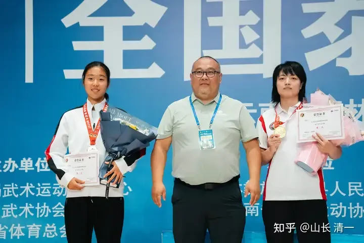

60公斤级的领导颁奖，冠军班王林畅获得银牌。

2026年，清一战队的女拳手，击败了全国锦标赛总共六个级别中五个级别的全部对手。这成绩，已经是全国女子战队中【没有对手的存在】了。

我相信到了2027年，清一战队如果继续参赛，全队精锐尽出的话，很可能将囊括所有女子六个级别的全部金牌和银牌。

第五块金牌：是男子51公斤级的黄奕儒武士！他也凭借此次的表现，获取入选2027世界锦标赛的资格。他也是2024年和2025年的全国冠军。今年他决赛中击败的对手，是少林塔沟武校的勇将郭赛。这个拳手很优秀，凶猛灵活，敢打敢冲。半决赛KO了对手进入决赛。可惜在决赛中，被黄奕儒强力反杀，第二局被KO失去比赛！因为他敢打敢冲的优点，面对清一拳手更容易被Ko。女拳手们已经总结了这个教训，因此原本在赛场上敢打敢冲的李丽姗，首次面对我们的拳手，居然开启了逃跑，避战的模式，就是女生们交流了对付我们的经验。

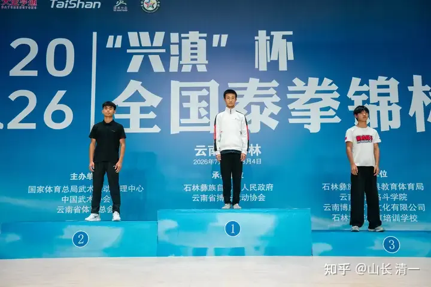

三届全国冠军小黄，却没有像队友一样，得到亚洲室内赛的国家队资格

第6块金牌：是男子54公斤级的刘轩宁。他在决赛中击败香港冠军（左一）黑衣人获胜。获取入选2027世界锦标赛国家队资格！右边第三名是塔沟武校的拳手，他是小刘在半决赛中相遇，被刘轩宁TKO击败失去决赛权！

在2025年全国锦标赛的决赛中，刘轩宁在局面领先的局面下，被对手多次击裆而失败。只拿到银牌。本次应该吸取了教训，香港拳手也喜欢击裆，各种花活很多。这次比赛，对手也有一次这样的行为。但未对刘轩宁造成严重损害。刘应该吸取了去年的教训，不然他已经参加了今年的世界锦标赛。现在已经取得了亚洲室内赛的国家队资格。

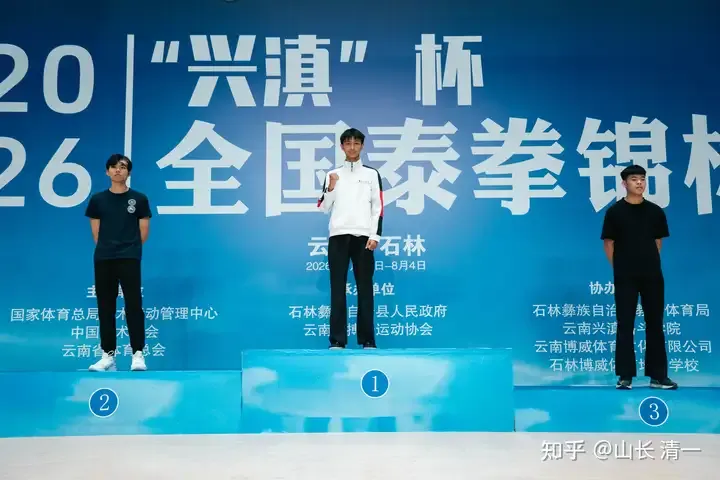
