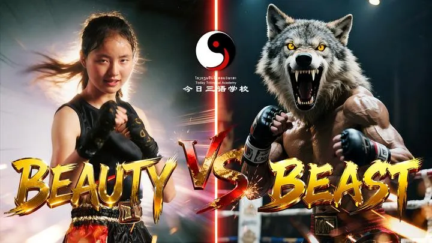
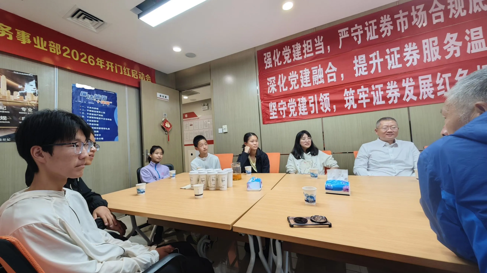

收录于 · 富裕家庭的教育与传承问题研究

乔安娜、常清杰 等 336 人赞同了该文章

今天文章，我认为价值万金。新教育的家长们一定要好好研读。不然：几年后，你很可能恨不得杀掉自己。如果不想自杀，你就想“杀掉新教育”来平衡恨意！

我们已经发现：一个2003年就结缘新教育的人，在这里呆了半年离开了，嫌条件艰苦。现在35岁了，他每天唯一可做的事情，就是每天发文章，骂新教育，骂今日，骂我。恶狠狠的，恨不得我们都死掉才好。

其实是他现在已经成为一个废物，一事无成。而且人生已经毫无希望。恨自己当年错过了最美好的机会。恨自己无能恨的要死！为了自己不死，就希望我们死掉。

因此，今日的每一份让我们很高兴的成就，我们走上辉煌的成果，都成为打向他脸上的耳光。让他仇恨愤怒和疯狂。因为他实在不能原谅自己错过的机会！

下面这个案例，是一个错过了今日，四年后家长选回头想跟上的故事。家长正在想要努力挽回一点点差距。

但真实的差距，不是四年，而是已经到了基本上不太可能挽回的地步了！

今天看到义塾的9月入学的招生面试汇报，有这样一家人很特别：

【面试情况：家长表示在孩子幼儿园时期就想进新教育了，等到孩子9岁去了行知读书，10岁还参加了今日夏令营，但当时孩子不太珍惜机会，身在福中不知福，因此离开行知，回到体制读了4年。孩子向家长表示，现在感受到了两种教育的差别，老师和伙伴都不如以前的，因此家庭就想抓住回新教育的机会。家长给孩子规划的学业目标是泰国朱拉隆功的法学专业。家里在磨丁有社区房，就是为了和新教育有联系，面试过程中也表现出了对义塾的关注和了解，以及带孩子提前开始了徒步练习。家长表示可以来磨丁协助一些工作，有空余时间。】

我看后哭笑不得的。这家长不知道该说他是聪明，还是不聪明。

说他聪明吧？幼儿园时候就知道今日的存在，14岁才真正行动。这孩子10岁的时候，明明可以来今日上学。

一年后11岁也可以来。

两年后12也可能追上最后的尾巴！

但家长一心相信体制，跟随体制！现在四年过去了，14岁的孩子，才看到了差距。（也许是已经看到了体制的绝望。我相信这孩子，如果在体制内表现很优秀的话，正忙着中考上清北，是不可能回头来上新教育的）

可当年一起上夏令营的小伙伴，有人已经拿到了SAT1590分，马上要进入冠军班读书了！他自己还在申请入学，还在练习徒步。可是还不能上今日三校，只能上义塾。

对比版：今日三语 今年14岁的SAT满分（1590分）学生 王浩宇的文章 - 知乎

随山长见银行行长——上午场235 赞同 · 45 评论 文章

如果你知道这两个孩子，都是深圳人。四年前，两孩子同龄，都在同一条起跑线上，就在上同一个今日夏令营。只是一个学生，选择了留下来继续学习。另一个聪明的家长，选择继续观望等待。。---虽然妈妈说是孩子不想留下来，其实应该是“家长舍不得孩子远离”。或者家长对体制学校信任度更高。因为是国家标准，肯定好。

但四年后，留下来的这批孩子，最差的学生，也考过了SAT1400分，达到了全世界7%的优等生水平。

最好的50%以上的学生，都超过了1500分！如上面的王浩宇同学。都是全世界1%的优等生！

马上这批孩子就要读冠军班了。四年之后，王浩宇同学，很可能成为ELLA一样的全国冠军和世界冠军（ELLA练拳也就四年，就站上了世界锦标赛的领奖台）。之后有可能成为国礼候选人。成为中国顶尖的文武双全的人才！成为国家文化的代表人物-----这是王浩宇“最好的命”！

而王浩宇“最差的命”，就是去读常春藤，读世界名校。走一条大家都熟悉的道路！但他会永远拥有一批“国礼朋友”，拥有一批顶层圈子的同学伙伴。

简单地说：王浩宇同学最差的命，就是这些推崇体制的家长们，日思夜想，追求的孩子最好的命！但他真实拥有的，远远不止这些家长们想象的空间和高度！

而四年前，放弃了王浩宇同学选择的这条道路的，自以为聪明的家长。今天虽然因为义塾的开班，有机会重新回头，得到今日的教育。但已经绝无可能去跟随，走上王浩宇同学能走这条的路了！今日三校不会对12岁以后的学生开放了！

他不是起步晚了四年！不是被耽误了四年赶上就行，重新浪子回头，四年后补上所有功课就行了！

他是走上了一条分岔路口。走上了不同的另外一条人生道路。基本上，这两条道路是平行线，几乎永远也不再有交汇的机会！

现在这位耽误了四年的同学，最好的命，也就是去读朱拉隆功大学了！毕业后再找个像样的工作（其实我不认为法学专业出来能找到好工作。家长这规划，除非家里有矿，读法律只是为了家族维护。否则想要拿来找工作，我看就是白白花钱的），去过普通人的日子。

这孩子，大概率已经赶不上父母的一代人了！（不像王浩宇，他肯定是远远超越父母一代的空间）！

就算这孩子现在开始，再努力，再奋斗，也永远也不会有王浩宇这样的同学伙伴。会一起陪伴他的人生。更不会有成为国礼的机会！

因为义塾学生，就根本没有进入冠军班的机会！无论成绩多好，多努力。这是与今日三语平行的另外一条线！

至于他最差的命----就不知道了！看他未来几年能否坚持，会不会努力了。

万一不努力，被开除回家，大概率就是上面这个35岁的老黑子的命运了！

说起来，也就是四年前家长和孩子一次不肯思考的，“轻松舒服”的选择。造成了今天天地之差！

当然，这家长还是聪明的。起码他在孩子14岁的时候，还抓住最后的机会想要回到新教育！

如果15岁以上，就只能只求多福了！家长面对的不是地面的平庸。而是地下的地狱，到底有多少层的问题了！孩子教育的失败和堕落，就是一个家庭最深的地狱！最苦的命运！

今日的大门对这些15岁之前没有来今日受过教育的人，几乎就是“永远关闭”了！多少人，多少家长，都想要18岁以后进入今日。可惜今日根本不收16岁这个年龄层的新人！只能自己自学，自己跟随！

更别说18岁以上的这群人了！除非家长有巨大的福报，愿意投资巨资！否则根本没有机会进入今日平台！

联想到居然现在，还有家长选择退学，离开今日回到体制去卷。这群家长，我只能佩服他们的选择英明智慧无敌！

我真的很想看到四年后，这群现在特别自以为聪明的家长，会有怎样的结果！

我希望他们有最美好的结果，虽然过去20年，我没有看过一例比我们更好，更值得学习的案例。

现在的国内，大量工作岗位的消失，已经是卷死人的局面！甚至连去跑外卖都卷死人了。

这些家长，却选择放弃小语种走向世界的蓝海工作机会，非要去拥抱国内的体制红海？

这些家长的脑子，得有多聪明，才能做出这样的英明决定呀？

但这群家长最好的一群人，可能就是我们彼此相忘于江湖，不再愿意看到我们。他们忙着做个普通人。对我们进入国家文化上层的辉煌，假装看不见，过好自己的小日子就好！

至于最差的这批家长---很可能也在天天骂我们吧！就因为在我们这里上过学，因此这批家长，看到我们的辉煌成功，与她们毫无关系。还成为她们失败人生的最好对照！会不会也会妒恨交加？恨死自己当年脑子进水了？恨不得跳楼去。

这些人，为了让自己不跳楼。只好给自己找个敌人，躲起来天天骂我们，希望我们跳楼，希望我们倒闭，然后他们就安心了！

丑陋的女人，最恨的就是镜子！

但砸掉镜子，其实也不能让自己更美丽！

但看不到美好，或者美好消失之后，能让自己心情平衡一点！

这就是最近两年，明明我们的成绩越来越好，但恶狠狠的骂我们的人越来越多了！

就像我们的武术已经登顶全国第一了。但一直瞧不起我们的孙大S。他的疯狂和咒骂却越来越恶毒了！

为啥？因为有些人选择了躲在阴暗处去度日的生物们，肯定是见不得阳光的。咒骂阳光是他们唯一来为自己获取安慰的手段了！

请家长们用这个故事，来好好的思考：你怎样才是爱孩子的家长！

你怎样才能为孩子的一生和未来负责！

而不是只会关心孩子的吃喝玩乐！

更不是让孩子随大流。跟随大众去卷死卷生！
