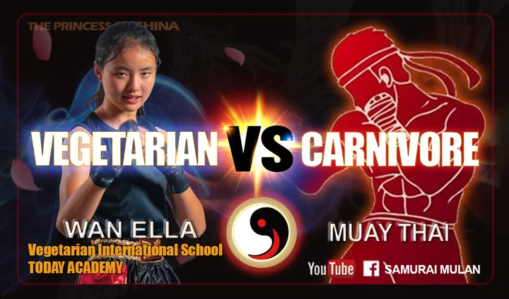
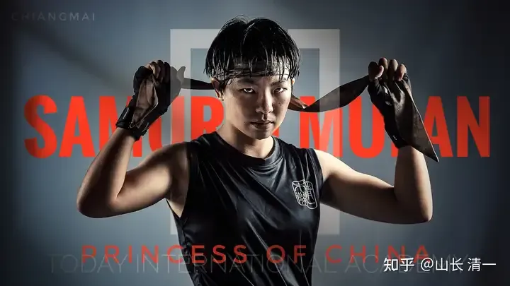

收录于 · 清一太极武术理论与实践

乔安娜、许静一 等 294 人赞同了该文章

云南省搏击协会，已经安排了ELLA公主和其他三个女拳手（佳慧，陆鸽和佳彦），在国庆期间与男拳手对战。这是云南商界在国庆期间，为了游客而设置的节日庆典特色项目！全国独一无二。

注定会吸引大量的人群前往观战。届时我们将在网上直播赛事。看公主们一步一擂台，逐渐走上她们人生的巅峰！

这群全国冠军公主们，将在10月2日开始，连续打六场男女对战的格斗赛事，在昆明设擂挑战男性对手。为了提升竞争的激烈程度，要求是获取了全国自由搏击和泰拳锦标赛前三名的男拳手来参加。因此---不是一个打业余男拳手的比赛。而是打优秀的专业男拳手的比赛！

这也是公主们用自己的实际的行动，来捍卫中华传武的荣誉，来打清黑们对公主们的战绩进行造谣和抹黑的耳光！

清黑们原来一直到处造谣说：清一格斗是骗局，是糊弄粉丝的洗脑游戏

后来我们的全国锦标赛战绩出来了， 又说：国内的格斗赛事很水，没有啥含金量！要打就去UFC，完全忽略了锦标赛和商业赛事，根本就不是一回事!

再后来，我们取得了世界冠军，再说我们的格斗水平不行。就是抹黑全世界的格斗赛事了。

因此清黑们有改变说法了，又说：清一格斗，只适合女生练，不适合男生去练！反正清黑的嘴巴不值钱。啥瞎话都敢说的！

还说：中国的女生，在格斗界就没啥竞争对手，因此公主们打出来不难，拿冠军很容易！不懂格斗都可以去打全国锦标赛！

还说：男拳手和女拳手格斗上，就完全不是一个等级的。清一公主们都是投机取巧的！

这简直是睁着眼睛说瞎话！

武道馆某些男拳手，没有打出女生的优势，是因为原来武道馆早期的男拳手，就是一些自以为是，不尊师，也不信师的大笨蛋，只相信和崇拜现代格斗。平时也不好好的练功，更不好好的练我教的太极功夫，反而喜欢投机取巧！喜欢去玩弄一些花活，在女生面前显摆。根本就不尊重祖宗的宝贝，不踏实练功。还给女拳手忽悠说：山长教的，也不一定是对的，因为山长也没上过擂台，不懂现代格斗等等！都说他自己想当然的功夫。

男生用这种心态去练拳，当然结果就打不好了！但把自身的责任不谈，专门去推锅，去找一切理由来为自己的不成器找理由，本来就是清黑的思维方式和特点，但居然有些家长和学生，还相信这些人的鬼话，实在是糊涂得可以！

相反，清一战队练拳的女生，就更老实一些。会更加相信老师，会更认真，更踏踏实实的练功。因此女生取得远超男拳手的战绩，一点也不奇怪！

清一派传武实战的最大奥秘。就是我们的格斗技术是压制现代格斗的，会让对方无法发挥自己的技术。因此就算我们赢不了对方，也不会让对方赢我们。可以跟最强的拳手也打个不相上下！

实际上，清一两个男拳手，认真练拳，就打出了压倒性的优势、特别是黄奕儒，练拳才四年。但今年已经是三届泰拳锦标赛的全国冠军了！稳稳地守住了他的量级，还KO了国内最强的对手。怎么能说男生学传武就没优势呢？明明是自己没有好好学。

最近结束的全国青少年泰拳锦标赛。公主塾才练了半年多的小女生，就和两年前的全国冠军打个不相上下。第一次上阵，就拿到了金牌，更取得多个银牌铜牌。让孩子们对传武的信心大大增强！

实际上：如果真正采用我们的技术，女生去打男拳手，都不会有危险的。这就是女生们敢于去擂台设擂，去和男生拼杀的原因。2024年，ELLA公主和陆鸽就挑战了泰国的男拳手，最终陆鸽还Ko了泰国职业男拳手！

在这种战绩之下，还有人出来质疑传武面对现代格斗的实战效果，实在是瞎了眼！

但公主们由于在国内，已经没有任何女性对手了。因此她们也希望提高难度，去迎接男拳手的挑战，去训练和提高自己，以便将来能够去世界赛场上为国争光！

这就是公主们在昆明设擂，挑战全国的男拳手的目的！

为了公平，本次赛事将在赛前半小时称重确认体重。我们不支持玩降重游戏。我们希望双方都已正常体重来对打，相同重量级别的男女配对来打。我们女生不站男生的便宜。我们在同等条件下来打比赛！

看看练了传武太极的女子，能否对抗现代格斗训练出来的专业男拳手。

大家有兴趣的话，欢迎10月份来昆明现场观战！
