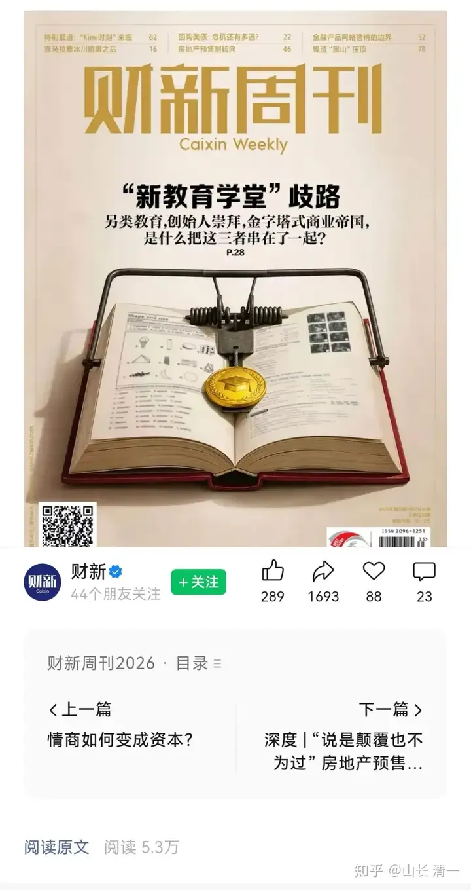
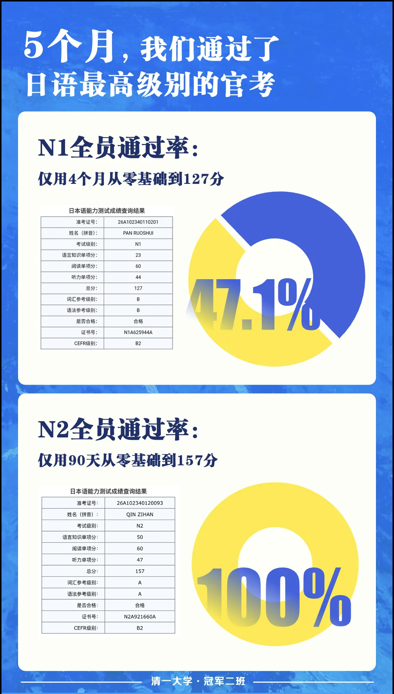
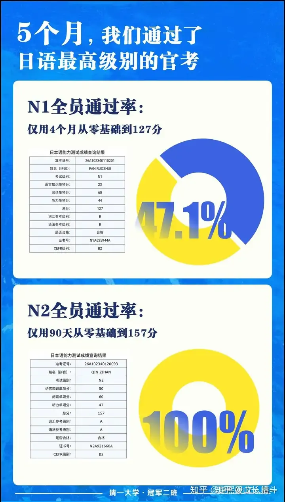

清一新教育有七宗罪，活该得到七大罚！

清一新教育的罪过一：外语是用来卡人的，怎么能真的学好？该罚---驱逐罪！

2003年，我创立今日学堂。由于我自己学了十几年的外语，依然不会听，不会说，也不会读原版书，只会考试。我认为这样不行，我的儿子不能继续这样学了，浪费了宝贵的时间，还把人学废了。心态学坏了，智商学低了，脑子变迟钝了！

因此我花了两年时间，专心研究外语学习的奥秘：最终发现苏联克格勃用【间谍小镇】模式来训练特工的方法，特别有效，只需两三年，就可以快速培养出足可乱真的，拥有地道外语能力的特工。因此我就开发了一种叫做【自然英语学习法】的创新学习方式，通过让学生去模仿真实的外语生活环境，来学会外语。不再像体制一样读教材，背单词，做习题傻学英语。【当然，这个创新的目的，肯定不是为了去做间谍】

我当时认为：一个孩子，从五岁开始学习，五年后他10岁，英语水平超过大学生，应该没有问题！毕竟---中国大学生的英语能力是很差的， 只要求掌握4000到6000单词就够了。国外小学水平而已。

因此我写了一本书，叫做【十岁达到大学英语水平】，还印刷了一万册，到处送人，我以为是做功德，结果被人骂我是骗子。

他妈的，老子一分钱没收，白送你我研究了两年的创新学习方法，你们和骂我是骗子？脑子长哪儿了？

因此我就开班收钱，按照这个方式教学生，想要用几年时间来证明---我可以批量培养出超越大学生英语水平的小孩子。这就是今日的第一个明珠班。无名的田芯语，就是当年这个班的学生，傻傻的小女孩，今天成为了无名最受欢迎的指导。

不过当年，因为我是老板，不差钱。所以当年办学，学费，生活费一起，总共才一年一万五！虽然办学赔了钱，但赚了一个贤妻。因为刘老师，就是因为要送静慧来学堂，才有机会认识的！

这个教育模式，我成功走通了。但---这就是我罪过的开始，比我当“骗子”更大的罪过降临我身上了。

因为我显然破坏了行业的常规，居然真的批量教孩子学会了外语。这让别人怎么挣钱呢？这让提职称的领导们，怎么卡员工不让晋升呢？

因此，违反天条的我，就因为“非法办学”，被当时的武汉市教育局局长谢世腰，赶出了武汉，开始流浪江湖的生涯了！

而且---当年有人还弄了一群黑帮流氓人员，来当时办学的汤逊湖校区闹事，去骚扰和驱逐我们的孩子。当年的静慧也就是11岁而已，亲眼见证了江湖世界的腥风血雨。这到底是谁干的，我就不知道了。没有谁出来说是他干的！只能猜了！

清一新教育的罪过二：学校是培养打工仔的，怎么能真教学生素质呢？该罚---流放罪！

当年，会泽时代的新教育，我认为外语没啥了不起的，洋人乞丐也会说外语。因此我认为---读古代圣贤的书，才是真正的教育！因此，我在云南会泽，开启了明一班模式教育。12岁就带学生读【资治通鉴】，【论语】等书，还读【笨蛋没活路】。【西西里人】等社会小说，让孩子们成为有文化，有思想，有素质的一代人。

培养出来的成功学生代表，就是无名现在的校长静慧。培养失败的学生案例，就是WC。但WC一出山，就能年赚数百万元，似乎也不能说是很失败？当然，另外还有一些WC类型的失败者，虽然没有WC会赚钱，但跟WC一样，不喜欢去做打工仔，她们更喜欢去做没事可干的闲人！甚至是无聊至极的清黑。这样看来，的确可以说，WC因为优秀，所以还是值得几百万的。

这样影响别人赚钱，打工机会的清一新教育，当然是有罪的。因此我再次被当年任上的，会泽县教育局局长--陈家明同志赶走了----再次被罚---判决流放罪。

因此我和伙伴们，就只能离开会泽，流浪到其他地方。原来在会泽县城大量投资的房产，就被闲置了！

清一新教育的罪过三：体制学校就是应该12年才学完的，怎么能三四年就学完呢？因此该罚----判决驱逐出国---流放南伯利亚。

从玉溪时代开始的办学，就让我对这个到处出清黑的世界投降了。不再坚持一定要做素质教育了。---家长们送孩子来上学，不就是要考大学，拿打工证，去做优秀打工仔吗？好吧，我就替家长多快好省，培养优秀的世界级打工仔，考上最好的大学好了。就不再去苦巴巴的专门做「素质教育」了，辛苦，吃力还被人骂。

我研究的结果，就是体制教育太拉垮了。完全就是草菅人命（浪费生命不就是杀人吗？）。体制学校需要学习12年的课程，其实完全可以只用三到四年的时间就全部学完了！可是，全世界的体制正规学校，还一直是老牛拉慢车，非要慢慢的学习12年，还有大量人学不好，这些K12课程，真的三年就可以完全学完了。

因此，玉溪新教育时代，就开启了大家现在熟悉的---【新教育突破班模式】

以当年的示范班为开始，现在的冠军班为标准，今年已经是第七个年头了。现在，我们已经有三个年级的冠军班了！冠军一班，明年就要从清一大学毕业，要去读世界大学了。我相信他们会申请一堆常春藤出来的！

这些学生，全都用4年甚至不到的时间，就学完了体制K12课程需要12年才能学完的课程。而且整个班级的学生。美国高考SAT的平均分都达到了SAT1470分以上。这是美国最顶尖高中才可能有的成绩！甚至我们取得1500分以上的学生比率达到了惊人的50%以上，远超世界平均水平1%。

新教育怎么能这样玩？还让不让别人活了？美西的跟班走狗，还有国际学校的一档子人，不想搞死你吗？新教育就是来搅居的吗？

我们这样做，家长和学生满意了。但其他所谓搞教育的人，办K12教育的教师们，投资人等，眼看着全世界最舒服的，专收智商税的国际教育饭碗，很可能会被我们砸掉。这怎么行？必须收拾我们这群不懂规矩的家伙！于是---

该罚：罚你身边的人背叛，罚你驱逐出国。于是大清黑熊杰和黄小燕出马，说到做到，真的把我们辛辛苦苦建设的玉溪学校，就一锅就端了。两人还想把我们的清迈和磨丁学校一锅端呢，可惜没得逞。

但两人，害我们现在的学生，教师和家长们，全体和流浪到偏僻的“南伯利亚”了。在这里，我们跟上千个国外的妓女，一起生活在同一座城市。

妓女们选择在这个经济特区的原因，是可以享受“卖身”的自由。她们的进驻口号是：我的身体我做主！来这里是享受不被警察盘剥威胁的自由，不用偷偷摸摸卖身的自由。这里让她们可以公开地，自由地，出卖自己身体。只要双方同意，第三方不会干涉。

而我们选择这个经济特区的原因，是可以享受“卖教育”的自由。我们的进驻口号是：我的教育我做主！享受不被教育官员和教育大纲限制的自由，享受不用偷偷摸摸卖教育的自由。在这里，我们可以公开地，自由地出卖我们的教育思想。只要家长们同意，第三方不会管我们怎样教育孩子！

的确：这里的官员们工资太低了，因此连妓女都懒得管。当然更不理睬我们这群外国人了！

本质上，我们和妓女都是一样的人---都是想要逃离限制，追求自由的可怜人！

因此，我们在磨丁，也不敢瞧不起妓女。她们凭自己的劳动吃饭，自愿提供服务吃饭，谁都别瞧不起人。在国内做妓女也不容易，国内虽然到处都有妓女，但都只能偷偷摸摸的做，不小心就会被警察抓起来罚款，会被黑道人员威胁控制等等。真心不容易，肯定比我们私下做教育还难，和我们一样，是随时可能被人举报的。在这里，磨丁特区，她们才可以公开的出卖自己。

我们这两群人在特区相遇，就像【霸王别姬】电影里面，戏班的班主，遇到小豆子他妈的场景一样。台上唱戏的，是看着光鲜，看着很英雄。力拔山兮气盖世。但走下台子，本质上和卖身的妓女是一样的低贱，大家都是下九流，都是看人脸色，做“服务娱乐行业”的人。都是被“高贵的上等体面人”排挤的可怜人。

可这些赶走我们流浪异国的清黑们，却因此笑话我们办学的档次低，居然跟妓女做一个城市。好吧---我们承认清黑的档次就是高，比妓女要高一等。

另外---你们的卧室档次也很低，居然跟厕所在一起！哼---没水平。古人可不是这样教的。

另外：我在寻思---全世界最牛的教育，全世界教育水平最高的学校， 却不得不被权力人员排斥，流放，驱逐。最终让最牛教育，不得不和妓女同城生活。得到一样的“公平待遇”。这个对比，就不知道是妓女的光荣，还是教育行业的大丑闻了。

但在清迈，光彩照人的木兰们去拳场比赛的时候，旁边就是接客的妓女街，周围都是吸毒（大麻）的店铺。空中满是大麻的味道。但---不妨碍木兰们绽放成为国礼，就像荷花根植于污泥一样。

于是，你们今天，就看到我们从事新教育，不断提升自己教育水平的后果了----由于追求多快好省，帮助中国家长的罪行太过严重了。我就只能在2017年就离开故国，避居泰国生活了。由于已经在国外连续居住5年以上，我的身份，已经晋升成为了“华侨”，孩子都可以参加“华侨高考”了。现在，我连“中国纳税人资格“都没有了。国内的企业和单位，我已经有20年，没有参与任何一家企业和单位的经营和管理！只是投钱的小股东！（清黑就别说拿纳税来说啥的，显得你无知。或者别有用心，故意搞混的）！

但我们的学校学生和家长，以及老师，还不想来泰国，实在舍不得离自己的母国太远，就来到了老挝的磨丁。在300米以外的15层楼房里面，大家起码还可以眼巴巴的看着近在眼前的国门，寻思什么时候---清一新教育才能结束流放“南伯利亚”的悲惨生活，回到中土大唐---繁荣富强的家乡去生活和发展！

新教育上了财新的封面。荣幸之至

清一新教育的罪过四：武术就是中国人拿来自已娱乐的，你怎么能真的会打？该罚-----罚你去关禁闭！

中华武术在最近这一百多年来，基本上就是被西方格斗按着打的。中华武术无敌的威力和魅力，主要是体现在武侠小说和电影，电视剧中，舞台上显摆。表演。

就是不能在擂台上真打！。。。

在世界格斗擂台锦标赛上，中国拳手常常是第一轮就被淘汰的结果。只有少数去国外训练和发展的明星拳手，靠苦苦的跟随学习西方现代格斗，勉强能活下来！

因此，中华武术主要就是一个中国人的娱乐工具，是公园里面的老头老太，拿来假装玩侠客情怀的舞蹈。可以健健身体，活动一下筋骨。别指望他有什么真正的格斗实战能力！

但我在被清黑们驱逐，去泰国流放的时候，我用了两个多月时间，天天去泰拳馆，观摩研究泰拳的奥秘，我就想看看五百年不败的泰拳，是怎样训练的，最终发现也不过如此，没啥特别的伎俩。属于傻人练笨拳，就是一身的横练功夫。只要我教的弟子聪明一点，不去直接模仿泰拳的技术，不跟泰拳拼消耗，再加上用中华武术的技巧，去对付泰拳，各种外家拳，都很容易！

于是，一群文人学霸，只要认真的训练三五年，都足够去应对这些从小练外家拳的---格斗职业拳手了！

看懂了就去做：我从2019年开启了武道教育的尝试，想要恢复中华传武的荣耀。跟我2003年刚开始办学一样，也是不计报酬的，全免费培养一批学生。五年后，果然培养出了世界冠军，还拿到了一大堆的全国冠军。目前已经是蝉联两年的全国第一格斗战队。全中国的武林界拳手，至少在泰拳项目上，都败给了清一战队！

特别是今年的全国泰拳锦标赛决赛日，总共就只有21场比赛，居然9场比赛都是今日系的拳手争夺冠亚军。而且获得9场全胜战绩（其中两场还是内战），震惊全场！成为集体金牌和奖牌总数第一名。冠军一班才学了两年的太极格斗，今年就拿到了8枚金牌，14枚银牌和14枚铜牌。

今年，国家体育总局武术中心，就选了9名清一拳手进入泰拳国家队。我们的拳手，正在兴致勃勃的，准备好好的去收拾洋人，打出中华武术的威风和志气来！

可是---取得这样的优秀战绩，我们就更有罪了。这传武，本来就是拿来玩的，拿来赚钱的，拿来哄国民开心的，拿来骗钱的。你怎么能真的会打？还这么能打？

于是财新周刊的记者范俏佳，就在清黑团队的全力支持下，发表了万字声讨文章。想要把新教育连跟拔起，把我们打成黑帮，打成X教。想要把我们所有人，都干到小黑屋里里面去关起来！

清一新教育的第五宗罪：5个月学好一门外语！（一年突破小语种K12?）

转发下面的链接。冠军拳手钟熙媛参与的带班结果，创造了清一新教育创立以来的最高效率外语突破记录：用五个月，就达到了小语种最高的标准等级成绩！ 文人格斗的文章 - 知乎

冠军二班｜日语官考成绩大通报！150 赞同 · 51 评论 文章

看看我们的不断刷新的教育历史，现在的新教育，显然就更可怕了！

新教育用了23年的时间去探索新教育的道路，每年一个台阶，几年一次大的刷新升级，水平越走越高，也被黑们驱逐得越来越远！

第一步：2003年开启，我让学好一门外语的时间，从十几年学不好，到四五年就能学好。完成了新教育第一次跨越！有罪被罚离开武汉！

第二步：2016年，我被攻击只会教语言，不会教数理化，于是把外语和体制所有的课程结合，用3-4年学完全部的数理化语文外语科学等等课程，完成了提升的第二步。有罪再次被罚，离开会泽！

第三步：用13个月的时间，完成了任何一门小语种从零到C1的突破！等于一年超过外国语大学四年学习效果！

现在：冠军3班居然一步登天，居然用五个月，就学完了一门小语种！拿到最高等级的成绩。而且不是一个人实现目标，而是一个班。而且是全员100%通过N2。

如果这样算下去-----是不是将来只需要用一年，就可以把日本的K12课程全部学完吗？

这还得了？这更加罪恶滔天了！

我过去23年，比这低效率的清一新教育，三年学完十二年，都被罚的去当流落外国的丧家狗了！

现在你们居然只要一年，就学完别人要12年学的东西，这不是要别人的命吗？

我们学英语，就是砸了五眼国家的世界教育文化垄断权。砸了国际学校这个“行业”的金色饭碗！也打破了传统的教育平衡关系，当然有罪。

现在，我们用更高的效率来学习其他小语种国家的课程，不就是跟全世界为敌了吗？

这些人联合来对付我们，怎么还活得下去呀？我担忧死了！

清一新教育的第六宗罪（2027年犯罪预备---常春藤批量申请罪）：2027年，冠军一班毕业，注定会拿到一堆常春藤入学通知书。这个罪恶相当的大，抢走了全世界最珍稀的教育资源，该如何判罚呢？大家说说看？

清一新教育的第七宗罪----侵略世界大罪。清一战队将在2028年，打破目前由洋人，白人绝对垄断的格斗行业，登顶格斗世界锦标赛的顶尖战队！也许我们会成为中国人的功臣，但会不会成为全世界最大的公敌？

清一新教育，肯定还要这样继续 不断的超越下去的。也许将来我死后，木兰们还要去大战外星人呢。继续延续我开创的，新教育不断挑战自我。不断创造历史的辉煌。。。

我死还是不死，都挡不住这个潮流的！因为后生可畏！

这样的清一新教育，就真太可怕了。这么厉害，黑子们会怎么罚你们呀？ 会被罚到火星上挖矿不？

木秀于林，风必摧之！

难道大家都不知道古训吗？

呜呼哀哉，

左想右想，我这一生，真是罪孽深重的一生。我这六十多年， 干了这么多的坏事。所以现在，都只能流浪外国，客死他乡了！导致我现在，完全没有办法去照顾90岁了，一直在家等我回来的老母亲，真是不孝至极！

这个结局太悲惨，大家千万别学我！别来清一新教育。这里熊出没，请注意。

【我愿儿孙愚且鲁，无灾无难到公卿】---苏东坡的感叹，我真的体验到了。

追求平庸的大众，选择堕落的清黑们，怎么可以容忍与自己不一样的光明呢！

编辑于2026-09-12 13:10
