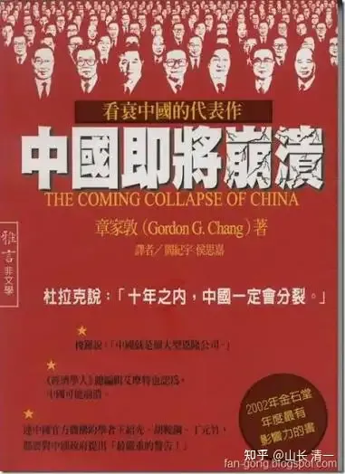
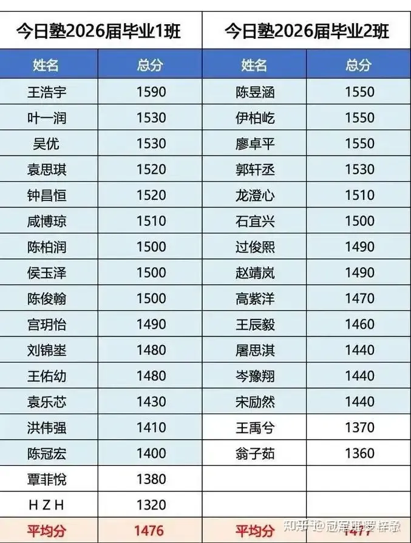
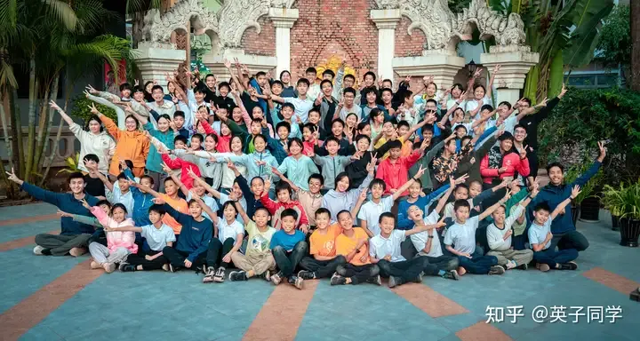
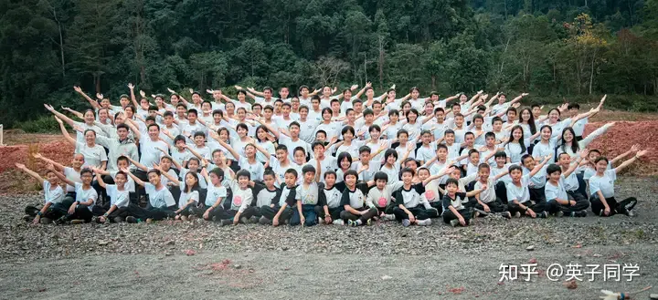
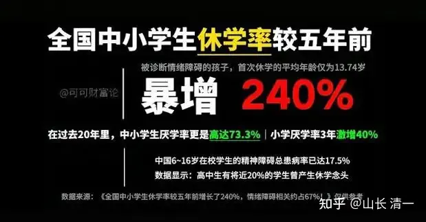
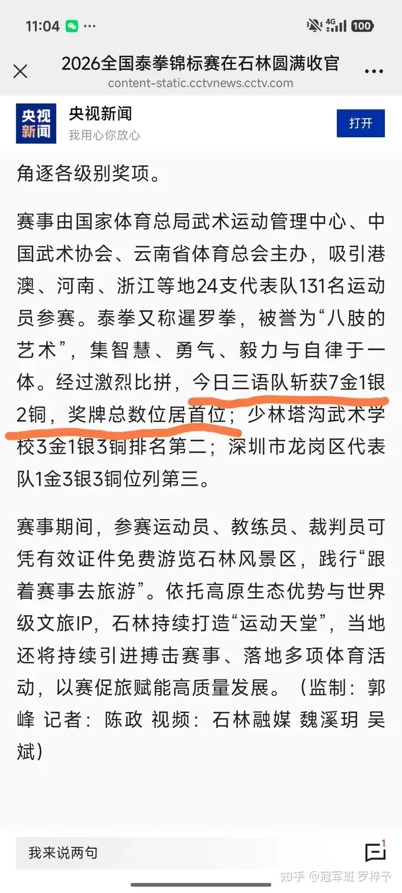
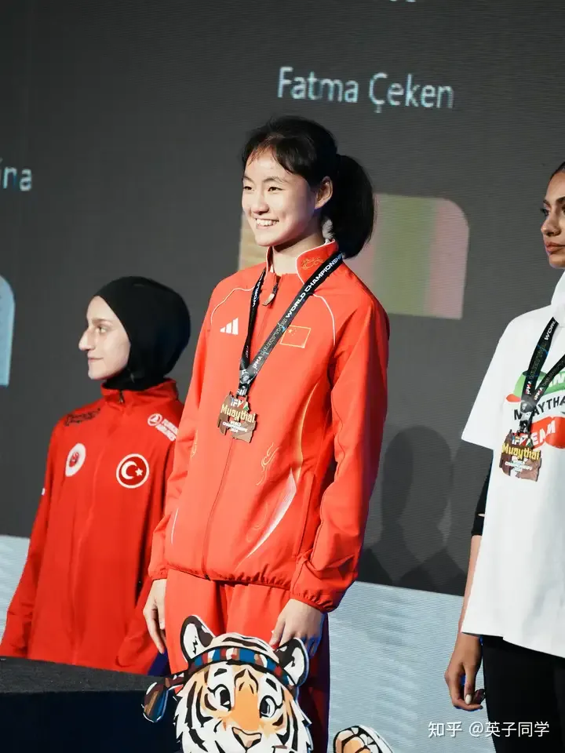
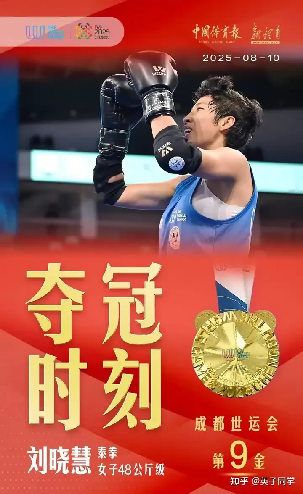
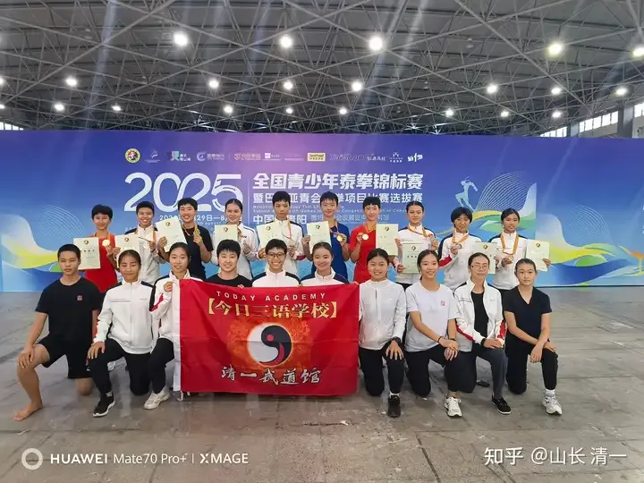

财新周刊某记者被人操纵利用，发起的对新教育的抹黑贬低的攻击。

这个事件，就像30年前，华裔美国人章家敦在西方支持下，到处去骂中国，黑中国，还煞有其事的发表【中国即将崩溃】系列书籍一样，今年已经是一个世界级的大笑话。

章某人靠拿西方人的钱，靠黑中国为职业，靠贬低中国来捞名，捞利。

现在，原来这些相信章家敦黑中国鬼话的香蕉人，美国人，西方人，现在都恨此人入骨。恨他误导了自己。看低中国的潜力，导致了西方人错失良机，今天西方人面对已经强势崛起的中国，只能叹息！ 

瞎子心瞎眼瞎，才会相信章家敦黑话鬼话

相信清黑言论的人，就像相信章家敦论调的某些愚蠢的国人一样。结局是注定的！就是这一生错过最美好的事物。就只能在过去30年的某些国人一样，去拥抱注定腐朽的西方。结果就完美地失去了与中国共同发展壮大的宝贵机会！

这些人，现在就只能眼巴巴的看着中国力量的冉冉升起，而无可奈何！

相信新教育也一样。过去23年，看不起和贬低新教育的人，现在收获了什么样的结果？

相反：一直追随新教育到今天的人，又收获了什么样的灿烂到不敢想象的结果？1590分的SAT成绩，格斗世界冠军的结果，都已经完美呈现。 

清一新教育发展过程中遇到的困境，特别像华为在世界上发展壮大中遇到的困境——都是因为表现过于优秀，远远超过同行的想象。因此成为被这些黑心人和黑手们贬低，攻击和打压的对象！

华为的目标，就是要在被美国和西方的打压，制裁，攻击，被严重限制的情况下，超越英伟达，成为世界第一。

这很了不起，配得上是中国科技界的英雄和榜样！为国为民争光的国之重器。

黑子们不服华为，就去击败他吧。可是，连美国集中全世界的帮手一起来打压华为，但华为依然每年都在创造和提升，这就是实力所在！这就是中国的国运所在。

清一新教育的目标，就是要成为教育界的华为。就是要超越哈佛耶鲁这些传统的老牌帝国主义的名校。

西方教育走的教育老路，我们没必要去模仿跟随，只管超越！制定全新的，中国人自己的教育标准和教育道路。

经过23年的探索实践，目前清一新教育，今日三语学校的教育效率和教育结果，已经是世界第一了！

谁不服这个结论，谁就来击败我们好了。目前我们认为：全世界的教育体系，任何学校，都不是今日三语的对手。我们敢跟任何学校和任何教育体系去比高低。任何贬低今日新教育的黑子们，都只能像特朗普一样，每天都赢，但只敢躲在后面叫嚣和围堵，但就是拿我们的发展没办法！

23年的历史和事实证明：

一：今日三语在教育效率，和教学成绩，两项硬指标均为世界顶尖，且遥遥领先全世界任何学校。

事实和证据：全世界的基础教育学校， 按部就班要学习12年的课程内容。但清一新教育的学生，都可以在3-4年内完成，而且取得远远超过平均水平的优异成绩。

目前历经7年，已经批量完成教学实验的学生，已经有三个年级的学生，完成了这个完全创新的教育实验。参加美国高考SAT的成绩，班级平均分最高为1515分，其中个人最高分为1590分（满分1600）。

超过50%比率的学生超过1500分。而作为对照，全球学生的SAT平均分----仅仅是可怜的1030分左右。

示范班开启第七年的全班毕业考试成绩单

看了上面这个真实的成绩单，请问：还有谁，在全世界的学校里面，能够再找到这样一个高中毕业考试成绩如此优秀的班级集体? 而且是一批15岁的学生，仅仅在学习三四年之后就取得的成绩。而他们成绩对应的全世界对比者，是18岁的国际高中毕业生？

如果没有的话：承认中国创新教育的优秀，创造了新的世界纪录，承认孩子们努力的成绩，就这么难吗？

有人非要编造谣言来黑新教育？是何居心呢？是不是和想要骂倒华为的黑子一样，见不得中国人的优秀？

二：今日三语的教学程序和方法，完全不同于传统学校模式。学习过程高效，轻松，愉快，因此新教育学生的学习积极性，自学能力，均排名世界顶尖，同样是遥遥领先！

新教育的学习模式，不再是传统课堂一样，老师上课，学生听讲。新教育根本不设“课程教师”，只有“学习指导”！

新教育教师的任务，并不负责输出具体的学科知识和内容，只负责帮助学生去调整学习方法，提升学习状况，安排教学程序。这种教师的任务，与传统学校完全不一样，是全世界完全创新的教学方式！属于中国人的教育创造。

首先教学内容和课程，新教育学校都只选择全世界最顶尖的教师来授课，不再是聘用一个平庸无能的普通课程教师来授课。新教育认为：只有最杰出的教师，才有资格成为学生们的学习对象。

如果新教育的学生要学习数学，当然就只要全世界最优选的数学教师来上课，这就是可汗老师，这个连比尔盖茨都承认不如他更会教孩子们数学！

如果孩子们要学习英语，当然是找美国，英国的播音员级别的人，来当示范课程的教师最合适了！

今日三校的带班教师。不负责授课，只负责把这些全世界最优秀的教师找到，并带给带给学生，指导学生跟随一起学习。在互联网时代，从全世界范围内，聘请顶尖的名师教学，这显然是一件很容易，也很廉价的事情！干嘛还找抱着老旧的，100年前的传统课堂教学模式不放呢？

因此，新教育作为全世界最开放式的教学系统，可以低成本地学习全世界所有的课程和内容，只要学生喜欢，想学就行。完全不受任何教学大纲的限制，可以根据学生和家长的需求，个性化学习任何课程！甚至个别学生可能一个人学习一个专业方向，与全班的学生都完全不一样！

今日无名塾学生合影（磨丁学校）

三语今日塾学生合影 （磨丁）

上面照片里面的学生，难道真的像是财新周刊范记者所说的鬼故事一样，这些学生都是被控制，被压抑，被饥饿，被恐吓的，教徒一样的学生吗？

三：今日三语的学生，身体素质，健康状态，体能和心理健康，各项综合素质和能力，均排名教育界世界顶尖水平，也是遥遥领先。

核心原因，就是由于只需要三四年就学完体制学校需要学习12年的课程和内容。因此，清一新教育有大量的教育时间，用于提升学生的综合素质！因此，提升K12教学效率的结果，不仅仅巨大地提升了全世界的基础教育水平，更是让孩子们不再需要把人生最宝贵的青春期，用来应付无聊的考试教育。而是可以大幅提升个人的综合素质，发展各种有益的爱好！

因此，清一新教育可以在完成N12标准化课程学习任务的同时，来给学生完善素质教育，提升综合能力，建设身体健康，学习日程生活技能，和进行一些社会实践，上大学之前去更多了解社会真实生活。当然，学生们也可以学习自己感兴趣的各种多学科的内容和知识，甚至一些学生，会提前去学习并完成一些大学课程，还一点也不耽误应试和高考。还节省了以后上大学需要的时间和学分，以及大学费用。

这种全面，综合的教育模式，水平和结果，不仅仅是世界遥遥领先，而且也是世界唯一！连对照的对手都没有！清一新教育，必将成为未来世界教育转型的榜样。

中国创新教育，也注定会成为未来世界教育在新时代，创新转型的榜样。传统教育必须改变过去受制于工业化教育模式，带来的种种不适应现代社会的问题，才能适应现代社会和家庭所需要的转变！而不是继续抱残守缺。守住过去的老黄历不放。

对比传统应试学校的教学方式，教学内容，传统教育模式都无法让学生接受。最终结果导致学生普遍厌学，厌学率，已经超过70%。学习积极性很差，自然学习效果也很差，导致恶性循环！

更严重的是：每年中国的学生们抑郁，退学，自杀的比率，已经越来越高。甚至是爆炸式成长！因此，这种传统的，古老的教育模式，难道还不应该顺应新时代的家长需要，而改变一下吗？

应试教育问题已经如此严重，为啥就不去改变？

四：新教育大学阶段成果对照1：外国语言文学类专业成绩，清一新教育的教学水平和教学结果，也是世界领先，没有其他学校能够做到新教育的水准。

中国一共有八大外院，23所语言类本科院校。“外国语言文学类”共有100多个细分专业。中国高校目前开设了几乎所有与中国有外交关系国家的高级非通用语种。全国每年通过普通高考本科批次录取的外国语言文学类学生，稳定在 21万人 左右。每年在校的总学生人数在80万人以上（还有研究生专业等）

这些大学本科阶段的教学任务，就是用四年本科的时间，学会一门外语。但四年之后，学生能够通过相当于欧洲语言标准B2以上级别的人，也只有70%左右。而且大多数中国语言类大学的学生，虽然能够通过书面考试，但外国语言的实际应用交流能力很差，哑巴外语的情况很严重！

至于更高一点的级别：在中国语言类（外国语）大学中，本科毕业时能够达到欧洲语言标准（CEFR）C1及以上级别（高级流利/接近母语者）的学生比率，全校全语种平均大约在15%至25% 之间。

而清一新教育的学生，一般只需要一年左右时间就能学完任何一门语言。并100%通过B2标准国际考试。

清一新教育的学生，学习一年以上，能够通过C1以上考试水平学生，可以达到惊人的50%以上！

其中清一新教育日语专业最新的成绩，只学了五个月学生就有47%达到了N1的成绩，这些学生如果继续学习一年，实现90%以上甚至100%通过N1，几乎就是必然的结果！虽然国际上 JLPT N1 的全球平均通过率，常年卡在30% 左右。

这个结果，可以说：清一新教育的外国语专业的教学水平，排名是世界顶尖的水准！目前没有发现全世界有其他学校的外国语专业，能够批量地实现这一优秀教学成绩的！

短平快，用不到一年时间彻底学会一门外语。

五：大学专业课程之：武术格斗专业，目前已经是全国第一（应该也是世界第一）

中国共有62所本科大学获批招收“武术与民族传统体育专业”，每年有数万大学生在读。还有360所学历教育的武术学校（职校，中专等），总共有40万左右学生学习武术！

如果算上全国各地大街小巷面向中小学生的非全日制、非学历教育的“周末武术馆”、“散打搏击俱乐部”等大众健身兴趣班，其泛武术学习人口和注册学员，将超过数千万人。

但是，在这样人数众多，强手如林的武术专业学校，都集体参加的，由国家体育总局武术中心举办的权威赛事---全国格斗锦标赛上，清一新教育的学生，夺取了2026年泰拳青少年全国锦标赛的奖牌总数第一。以及2026年成人全国泰拳锦标赛集体第一名的成绩！这也是清一新教育第二次获取全国第一的成绩了！

清一新教育，目前（2026年为止）已经为中国格斗的国家队送出了9名队员。代表中国与世界格斗强国竞争！并取得了中国第一个世运会格斗项目的世界冠军。以及成为了在世界泰拳锦标赛历史上，第一个为中国升起国旗的女子。获取了从世界冠军，到亚洲冠军，以及数十个全国格斗冠军在内的顶尖奖项。

而且：取得这个成绩，清一新教育中，真正在武道专业学习和练武的学生，目前仅仅是70多人！以这么小的人口基数，去面对全国40万人的武术专业学生，取得这个成绩，几乎就是神话一样的结果，是难以想象的！

央视新闻报道

今日三语学生冯月茹，成为第一个在世界泰拳锦标赛为中国升起国旗的拳手！

今日三语学生刘晓慧，成为中国第一个世界运动会格斗项目的金牌

更重要，更特别的是: 学习清一武道的学生，都是业余练武的非专业学生。她们都是在15岁以后，在取得优秀的学业成绩，考完高考之后，取得SAT1400分以上成绩者，才能开始学习新教育的大学课程专业！

首先要学习第三语言，达到大学毕业之后的成绩，才能继续学习“武道专业”！

因此，上面两位为中国在世界赛场上为国争光的清一学生，都是掌握四国语言的超级学霸。而且都是从16岁才开始学习武术和格斗，20岁就拿到了世界级的优秀成果！击败练武十几年的武术职业老拳手。

其中刘晓慧在拿到世界冠军后，马上就选择了退役，已经以1550分的优异成绩，被常春藤大学录取，入读哥大。

目前全世界，没有第二所学校，能够创造文武合一的教育结果！今日三语学校已经是世界第一，也是世界唯一一所这样的学校。

因为目前全世界还没有任何一个学校，能够同时在文和武上面， 都能做到世界第一！更别说两者合一，都让同一群学生来完成不同目标！而且这么短的时间，都能登顶世界顶尖赛事的领奖台！

只是这个太过逆天的教育结果，必定震惊世界的教育成绩，很多人还不知道，还需要几年的时间传播，才能为世人所知！等大家都知道了，清一新教育就自动成为世界顶尖学校了！

很快，也许不到两年后，世人就都能看到清一新教育的杰出和不凡！

现在的现状，就是全世界都没有一所文武合一的学校！跨界都没有这样跨的。

全世界就没有人，懂得如何去培养一批文武合一的学生。

甚至：全世界的武术专业人员，世界冠军们，都不知道自己如何才能培养出下一个世界冠军！

过去，世界冠军就是努力和运气缺一不可的稀有产物，就不是任何教育系统能够培养的东西！

没有一家武馆，一个教练，有机会持续的培养全国冠军以上人才。因为冠军是稀缺品，更多是靠运气！

但是在清一新教育这里，“冠军”却成为流水线一样远远不绝产出的产品。稳定输出。

作为新教育的代表，公主班目前已经有14位全国冠军，四位进入国家队！

但现在公主班的总人数，一共也就16人而已！

在中国格斗界，也没有查到武术格斗的全国冠军和世界冠军考上了一流世界名校的历史记录。

全世界也没有这样的历史记录。文化和武术，似乎是天然隔离的领域，所谓的隔行如隔天！

在中国和世界，往往都是孩子学习不好，读书读不进去，家长才送去上武校，去练格斗，找个出路！

在清一新教育这里，是先考过SAT1400分，再来练武，先文后武。然后才去上大学！

在文科教育上，今日三语以无可非议的标准化考试的成绩，击败西方教育模式的国际学校，以及大学相关专业，刷新世界教育历史！

在武术和格斗专业上，以权威的全国锦标赛，世界锦标赛的夺冠成绩，刷新了武术和格斗的历史！ 让今日三语均成为教学水平，教育效率，教育结果全国第一，世界第一的学校！ 

目前，今日三语，清一新教育，在全世界的范围内，是唯一拥有这样优秀教育成果记录的学校！断代的第一名！

这就是中国新教育的底气：我们不跟随西方的教育思想和模式，不跟随西方的教育和体育的模版，而通过完全的中国式创新，来击败西方已经延续了数百年的教育霸权！文化霸权和体育霸权！

编辑于2026-09-17 16:43
