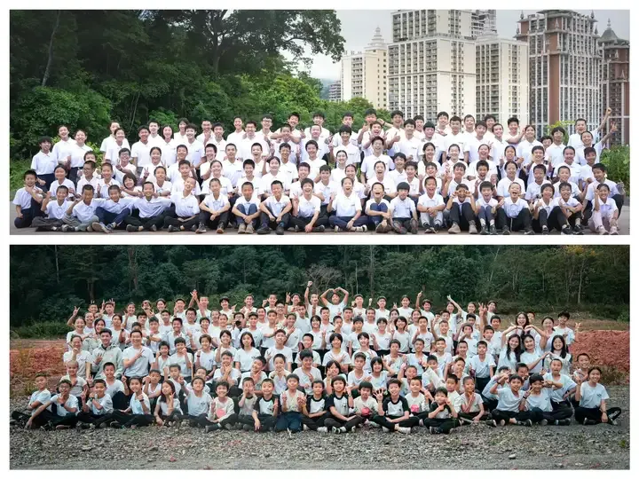

记者四问清一新教育：据说清一新教育的学生高中毕业的标准年龄是15岁，之后就开始上清一大学课程。为什么要这么小就高中毕业？15岁就上大学，会不会拔苗助长？会对孩子的长期职业发展不利吗？

答：毛主席说：“青年是整个社会力量中的一部分最积极最有生气的力量。他们最肯学习，最少保守思想，在社会主义时期尤其是这样。”

1964年春节座谈会上，毛主席说：“学制缩短以后，中学毕业生只有十五六岁，不够当兵年龄，也可以过军队生活。不仅男生，女生也可以办红色娘子军，让十六七岁的女孩子去过半年到一年的军队生活”。

今日学堂奉行的就是60年前毛主席的教育思想---15岁就应该中学毕业，然后去“过军队生活”，培养集体主义精神，建立伙伴合作意识。我们是通过学生全员开启练武，打擂台，和开展各项社会活动，来实现毛主席这种教育思想的。

如果让年轻人来自主决定学制的长短，他们肯定会尽量缩短学校的教学时间！而且---学生们还会尽量的不依靠教师来完成学习任务，因为他们不会想要把自己学习的权力，交给其他人！而且，从教育规律来看，学生越小，越容易接受教师的引导，更容易养成独立学习（自学）和终身学习的能力！

但如果让定制教育系统的人，来决定学生们的学习周期长短，他们肯定会尽量延长时间。因为教育系统的收入来源和权力都来自于学生，当然学校更希望更多地培养学生对教师的依赖性。就像是现在的体制学校带主课的班主任，一旦有机会，就会把一些副科课程的时间，占为自用，让学生加长学习自己教的科目一样！

但是，这些被教师全程灌输式培养，没有机会去自主学习的学生，而且一学就十几年，直到18岁才高中毕业的被动刷题的学生，往往在离开学校后，就失去了学习兴趣。因为他们没有养成独立学习和终身学习的能力和愿望。

因此，我们认为：长期低效率的应试学习模式，在教学中磨洋工，耗费宝贵时间，延长学制，才是对下一代最不负责的教育方法。短平快结束必须的应试课程，才是对学生生命力的最大保护！

今日学堂不是一个以校长和教师为中心的教学系统，而是以学生为中心的教学体系。新教育的校长定位，是服务于教师和家长的职位。而新教育教师的定位，是服务于学生的指导者。学生和家长都有权力要求换老师，一旦教师的教学成绩不好，学生和家长对教学的结果不满意，就要下岗待岗！这种民间教育自律模式，相比拥有稳定的编制后，就不会尽心尽力的教学，而是选择混日子的方式相比，哪一种更能帮助学生提升？我相信家长一眼就能看出来吧？

因此，新教育的教学设计，天然会尽量照顾学生和家长的最大需求和利益，当然学校也就会尽量缩短教学的周期，尽快完成教学任务！给家长交出靓丽的答卷。

而一个以教育官员，教师为中心，以教学大纲的本本主义为主导，学生本质上没有教学发言权的教育系统，肯定会把整个教育过程，拉长到不可思议的地步，周期长而收效低下。而且这个系统，会自动地培养学生的依赖性，让学生缺乏自主学习的能力和愿望，无法脱离系统！因为这个教学系统，为了掌控教学过程，不会鼓励和允许学生自主学习的，也不喜欢学生独立学习，独立进程。这显然会让教师失去存在感！

所以，现在18岁才中学毕业的教学系统设计，本质并不符合人类的发育要求。如果仅仅根据人的生理来判断的话，人在14岁就已经在智力和身体上与成年人没啥区别了。只是阅历和经验还不足够！因此大学的各种课程，对于14岁以上的学生，智力上是完全可以接受的！如果基础知识完善，14岁以上的年龄，就可以学习任何大学的课程！

从实际结果上看也是如此：新教育创始人1980年入读武汉大学工学院的时候年仅17岁，而当年的同班同学有两个才14岁。但这两个学生，相反由于心最静，想法最少，是班上成绩最好的学生，毕业后都公派出国留学了！当年的大学比较自由宽松，有很多这样的低年龄学生，会和30来岁的大学生一起上课。充分证明了年龄不是问题。

现在的学校都已经是齐步走了，都在18岁才入学！复读生年龄就更大了。实际上这种学制安排，并不符合学生的生理发展周期。更糟糕的是：学校用了太长时间的来搞应试教学，来做刷题练习。根本没有做有益身心的教学工作。这种机器人一样的灌输学习模式，对学生的正常成长是有明显负面影响的。

学生在整个中小学的学习过程中，根本就没有机会去学习对年轻人来说更重要的人生知识，以及社会知识。等大学毕业后，这批人除了考试读书之外，对社会都非常的无知。因此造成了很多不应该存在的社会问题，包括婚恋问题，人际交往问题，很多年轻一代都有严重的障碍！无法进行正常的人际互动和社会交往。

因此，今日学堂会在学生15岁，拿到了美国高考SAT成绩之后，就开始给他们上一些传统是大学生才上的课程，我们内部叫清一大学（当然没有官方的文凭。是一所孔子式的私人大学）。这样做的安排，是因为我们认为：15岁就去海外大学上学，面对复杂，自由的海外生活学习的环境，很可能会因为年龄过小，导致融入周围的伙伴圈会很困难，心理上也很不成熟。因此今日学堂对这些提前完成中学课程的学生，安排了一系列的【内部大学先修课程】，让孩子们先在新教育系统的内部，做好18岁以后去上大学的充分准备。这种方式，其实是非常人性化的安排，

首先清一大学会安排学生上外国语大学专业课程，学习第三语言。未来英语国家注定衰落，只会英语的话，就业和发展的空间很小。相反小语种国家有后发优势。因此我们让学生根据自己的未来职业规划，选择想要去发展的国家和地区的语言来学习。比如未来想去南美发展的学生，会选择西班牙语言和法语。想去亚洲发展的会学习日语，泰语和老挝，越南的语言。这种专业安排，本质上是服务于中国的一带一路政策。将来大学毕业后，去效力于这些海外发展的企业，做到了在海外工作，为国服务。

日本30年前就走了这一条道路，因此过去30年，虽然日本本土的企业和经济衰落。但日本的海外企业发展很不错，再造了一个日本！在海外为日本企业服务的人员，取得了比留在日本国内工作的人更好的发展机会！我们相信未来的中国，也会出现类似的这种情况！

第二：武道专业的学习和训练。由于新教育的学习效率超高。第三语言的专业学习，不需要像其他大学一样要学习4年才能毕业。我们的学生大致上只需要半年，最多一年的时间，就能完成小语种专业课程的学习！因此，清一大学会为学生开设第二专业，就是武道专业，去用中华传统武术征战擂台。

设置这个专业的原始目标，是奉行毛主席的“学军”教育理念，用军事化管理来规范青春期学生行为的方法。当然我们没有军队可以参加，只能组建“传武军队训练”。让学生在练武的过程中。不仅仅强化体魄，更重要是通过练武，炼精化气。度过人一生中，最危险，也是最关键的青春期。

实际结果，由于采用了高效，有针对性的传武技术，和实战训练，我们的学生训练不到三年，大多数学生都可以打进全国锦标赛格斗赛事的前五名。目前该武道专业培养出来的学生，已经全面战胜了全国其他武术院校培养出来的格斗手，成为了全国最强格斗战队！

第三：学习在清一大学期间，还会让学生全面地了解更需要知道的社会知识，去参加一些力所能及的社会实践活动，以及去打工等，让学生对自己未来的生活和职业去向进行思想上，现实上的准备。因此，清一新教育的学生，在18-19岁，正式去上大学的时候，无论上学的态度和学习的目标，都会比直接从应试教育12年之后考取大学的同龄学生相比，心理上，行为上都要成熟得多！如果记者实际来现场接触了解我们18岁左右的学生，应该很容易发现这种区别一点。

当然，最明显，也是最重要的区别：就是学生的身体状态不一样。新教育的学生，眼神更明亮，态度更坚毅。普通学校只会考试的学生，更像是心灰意懒的老人。两种不同教育模式出来的学生，差别还是很大的。

总结起来，就是清一新教育并没有在学生15岁学完中学课程，考完国际高考之后，在心智还很不成熟的时候，就把学生丢出去，直接送进大学，让他们与比自己大好几岁的学生一起学习，导致无法面对青春期问题，以及产生一些不适应大学环境的问题。

我们解决的方式，就是延长了学生的在校时间，让学生们在模拟的大学中学习，在熟悉的同龄伙伴环境里面，用三到四年时间，提前学完两个大学本科专业的课程。同时也帮助学生提前做好了去海外上大学的心理和行为准备，强化了学生的自主学习能力，让学生有3-4年的充足时间，去考虑自己想要上的大学专业和职业选择。因此，经过这套极其完善的教学设计安排，新教育的学生进入大学后，都能快速的适应学校，并取得学业的成功！

