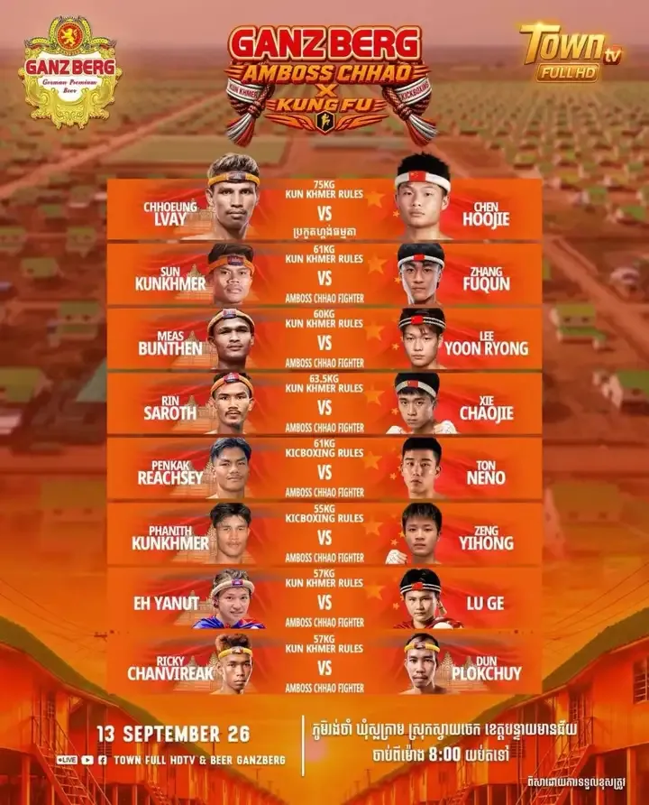
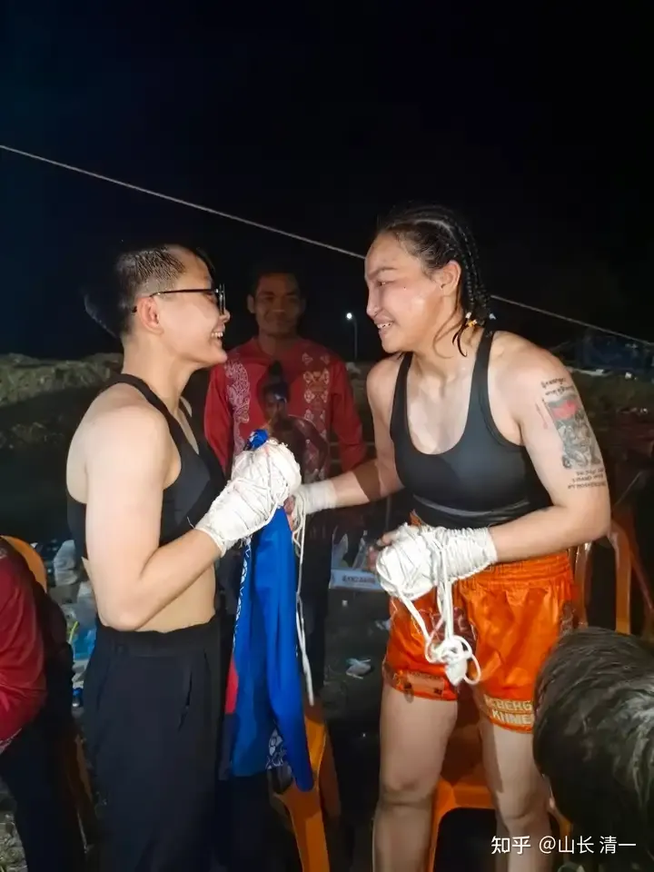
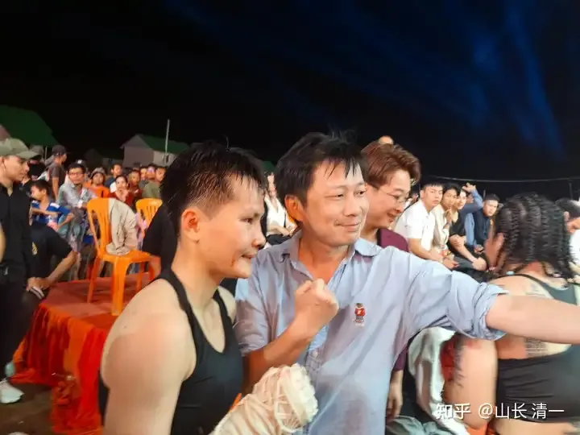
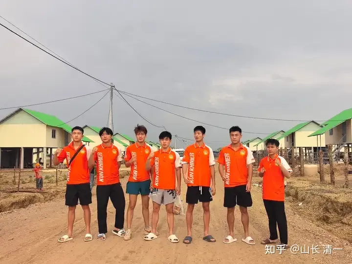
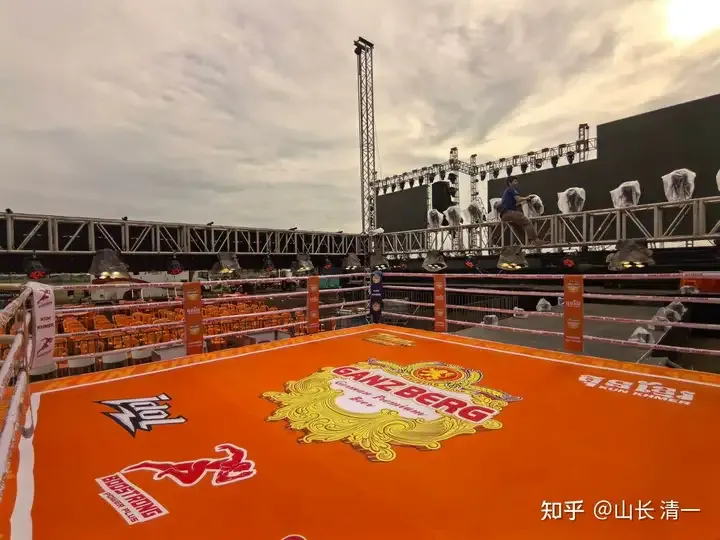
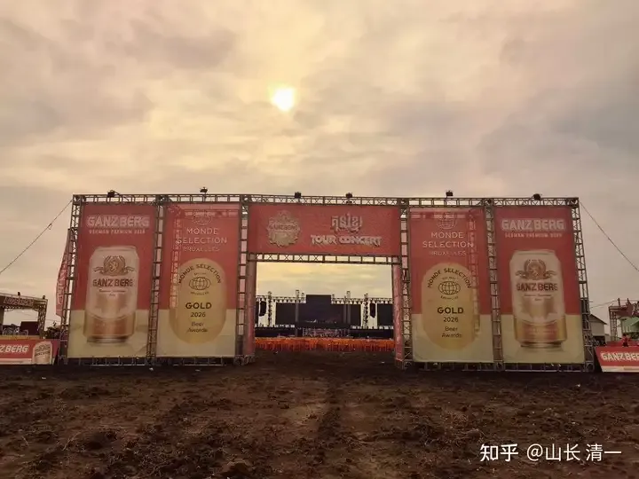
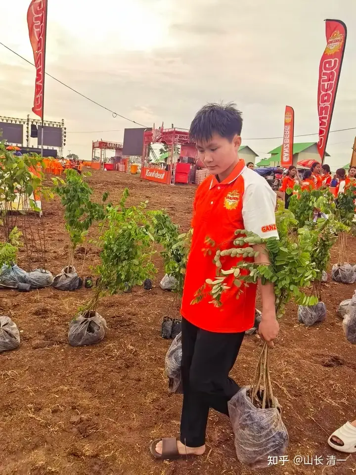
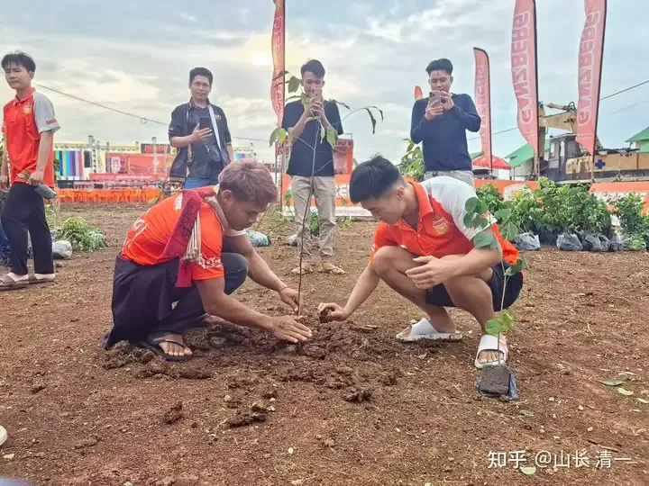

收录于 · 清一太极武术理论与实践

乔安娜、许静一 等 324 人赞同了该文章

今天晚上刚打完的中国--柬埔寨对抗赛，中国队派出七人参赛。这是在泰国--柬埔寨边境打的一场中泰文化交流活动，两国的政府官员都会出场，据说中国大使王文斌也来参与活动了！在金边称重和进行赛前仪式的时候，就有十几个记者一路跟踪拍照等。赛事显得非常的正式。

赛前我和刘老师一看是边境地区， 离金边很远。还特别担心，生怕陆鸽被电诈集团忽悠过去绑架了。教她和佳慧两人，一路上学会保护自己，还提前去大使馆查了活动是否属实?还主动提前备案了自己的行程。还要佳慧把每次转车的车号照片，都传到群里面。后来知道中国大使馆的官员也以及其他拳手，赛事组织者会和她们一起去，我们才放心了。

这次文化交流的缠拳赛，除了清一木兰陆鸽打赢比赛以外，其他派去的6个中国拳手居然全都输了，而且有四个人是被对方KO的，两个点数负，总体的结局是很惨的。怪不得中国拳手都普遍怕泰拳，还特别怕缠拳赛（不带拳套的古泰拳格斗模式）。这一次，在中柬两国大使和官员在场的情况下，拿到这个结果，其实很不好看。中国拳手一路打败阵，最后一个上场的陆鸽才三比零扳回了一场。总体上，中国队是很难看的结局！一个小国都打不赢，实在难堪。

所以，最后陆鸽的这一场终于打赢了，教练和队员们都非常开心，下场后中国驻柬埔寨外交大使主动找陆鸽合影。

这是两人赛后交流的对手照片。明显高大很多，体重大概比陆鸽多7公斤。这样还被压着打，三局全胜。现在，只有清一战队，能够在国际上为中国争光，拿到奖牌。其他的中国格斗拳手，很难打赢国外的拳手，就算是一个小国家的拳手，都可以轻松击败和KO我们的拳手！我国在武术格斗实力上，和国外的实力差距很大，毕竟是跟随别人的，短期上不来的。只有我们的清一拳手，靠老祖宗的技术，才能够击败外国人。

中国柬埔寨大使馆的官员，和陆鸽合影留念。

但我们的拳手，就是这样用老祖宗的技术传承来为国奋斗，维持住了中国拳手最后的体面。财新还要黑我们！清黑还要给我们泼污水。想要让我们的拳手不能为国争光。这些人，实在太坏了！

中国队赛前集体合影

赛前给当地种树

植树环节:赛前，每个中国拳手和自己的柬埔寨对手一起种树。很有文化意义，增进中柬拳手的友好交流。

打完比赛后，拳手连夜赶回首都金边，几个小时的车程。我看陆鸽3:44还发会消息总结赛事的经验，自己做得不够好的地方！据说赛后在金边，还要参加一些外围的活动。所以没有马上定回程的机票。

10月2日，陆鸽还要在昆明万达广场，应战男拳手，这种挑战肯定更大，大家期待吧。如果有空去昆明旅游，欢迎观战。现在观战是免费的，将来成名之后，可能门票会很贵喔。哈哈！
