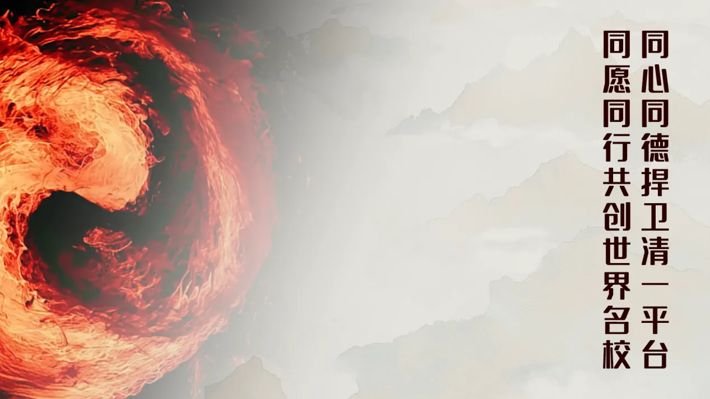

以为是一点孙某一样的民事罚款就完了？哼！

孙某是地头蛇，在昆明一辈子。他是找了人的。好不容易才把他本来该判寻衅滋事的刑事责任，勉强降到一个“民事责任”，但已经留下了案底。 这为后续追诉刑事责任，打了很好的基础！毕竟公安不负责最终的裁定。是法院才能决定的！是否起诉，就是后续的受害人了。问题是孙某威胁谩骂的不是ELLA公主一个，而是一群人。这里面，任何人都可以继续去法院告他寻衅滋事。偏巧孙某当时装黑大佬的污言秽语，都被冠军们录像录下来了！

孙某当时装怂，当着派出所警官的面，说他这一年多的网上发言，都是别人写了给他发的。他文化低，不知道怎么写文章！也不知道自己发了什么！

还当警官的面，给某人打电话，证明他网上的文字，是他们帮他写的！

这些事实加在一起，显然就是清黑们的团伙作案！你们都够刑事责任了！

现在还得意！

你们的行为已经取证，或者正在取证，你们就等著法律的严厉制裁好了！以为网上用AI造谣就不会被惩罚？

看结果好了！

一句话：熊杰黄小燕要找我敲诈，我宁肯把钱交给法院，交给国家，也不会给敲诈者的，这是最基本的公民常识！

清黑们以为你们只是打酱油？只是看笑话？

你们和熊黄孙这种敲诈勒索的人一起犯罪？还想假装自己无辜？无知?哼！

清一新教育|全网缺失的真相：财新记者范俏佳报道的背后，是一场精心布局的陷害220 赞同 · 121 评论 文章

