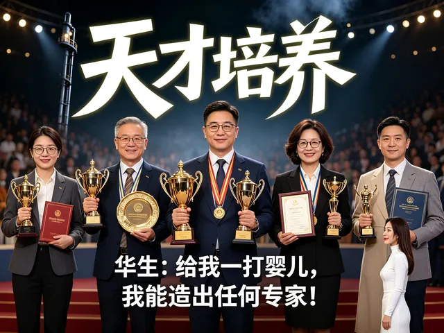

挺像我的。成天说：我们的公主，将来要拿一堆世界冠军。没人信，我也懒得多说！

【孩子成才的潜能，一岁开始培养，还剩八成。往后每年掉一截，到二十岁，只剩百分之五。培养一个人的窗口，就开在头几年，越早越宽，越晚越窄。】

这个观点我同意。

今日三校11岁入学，不是必须，而是被家长整怕了！只敢收半废的孩子入学了！

我的小女儿，是3.5岁入学今日的。

但家长们都喜欢把孩子教废掉之后才给我，我没本事扳回来！

因此---只收半废的孩子！还有拯救的机会！

也许以后义塾二代就会好一点！可以改变这种变态的教育心理了！

天才主要靠先天还是后天培养？293 赞同 · 47 评论 回答

