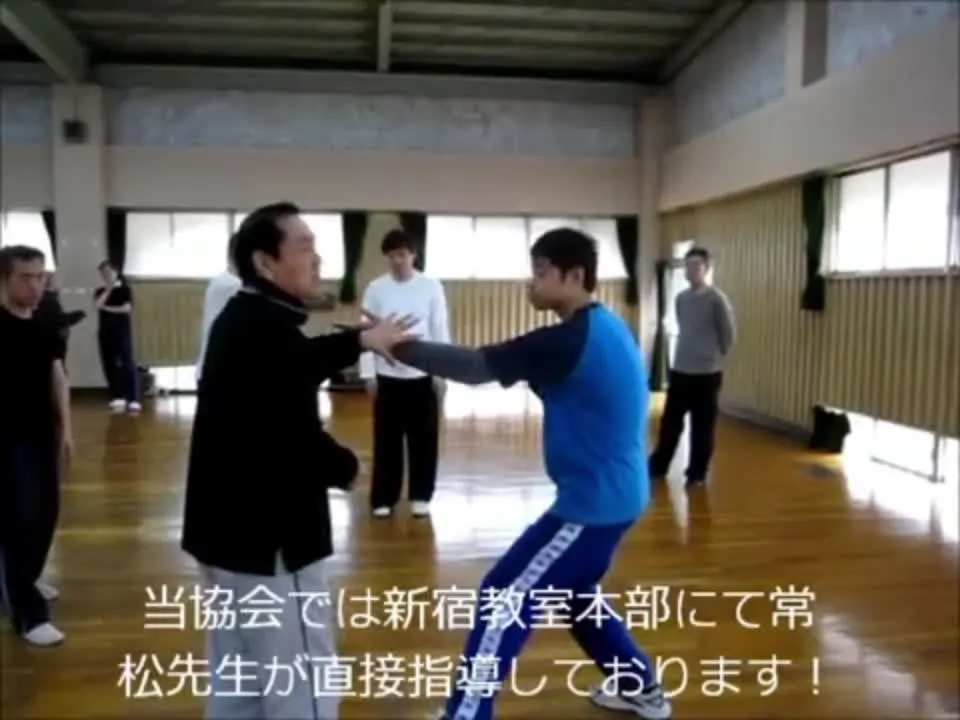

如果我们清一战队不出来，不去弘扬传武，用于现代格斗的话，最终，传武就真的到日本发扬光大去了！

将来中国人要学正宗的传武，就只能去日本留学了！

木兰们如果看到这个视频，会觉得很”亲切“的：她们平时，也是这样被我打的。很多动作真的好像。

这个人打的，真的是中国传武的东西。也在研究怎样用于实战！

可惜---国内人都在忙打套路，这种实战的功夫失传了！

等我们的木兰公主们去发扬光大吧！

​日本通背拳高手常松胜先生演示通背拳实战应用20 赞同 · 17 收藏 · 1 评论 想法

作者：山长 清一
链接：
来源：知乎
著作权归作者所有。商业转载请联系作者获得授权，非商业转载请注明出处。
