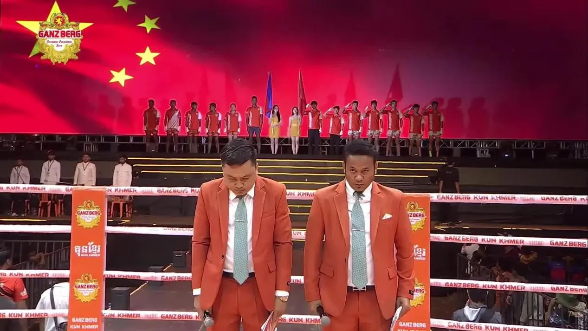

这是一场解说员完全认同是中国功夫来决战的泰拳。刚开始是觉得中国拳手风格非常奇怪，完全不一样。认为应该打不过这个明星拳手，看好对手的！

接下来看到陆鸽的肘拳正蹬都很厉害，改口为柬埔寨拳手找理由，说她很久没有打比赛了（其实也就半年没有打）！

后来说陆鸽跳起来很像马---解说员真的好懂行---正是“野马分鬃”式！

解说员说：向陆鸽致以最大的敬意，她真的打出了一种非常另类的方式， 非常难对付，每个回合都让昂亚狼狈不堪。而且注意到了陆鸽前一天称重轻了五公斤，对手超重（超过规定的57公斤1.5公斤。但陆鸽说没问题，她可以接受!

一场让外国人刮目相看的比赛，我相信未来会有更多的“非常另类的比赛”！会非常难以对付！

陆鸽的肘拳，的确提高了不少，看样子现在的训练方式非常有效，我们会继续的！

