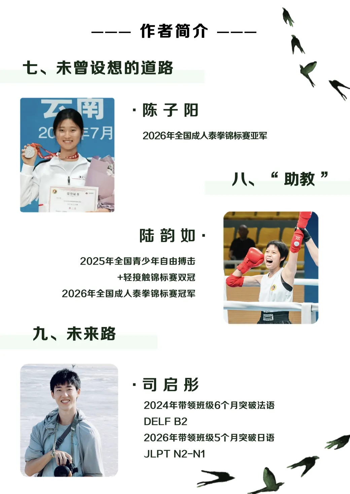

今天的分享者，一方面有在成年后才找到机会来补课，按照新教育的培养规划里，是不接受年龄--“几乎全废”（没有培养价值）的判断。仅仅是因为七年前表妹的不同选择，导致七年后明显的差异对比。父母经过特别艰难的申请后，才有机会来公主班当“旁听生”的陈子阳。

她居然本次全国锦标赛，取得了KO外家拳手的战绩。这个结果，估计把自己都吓了一跳！赛前，我们和她父母，都预判她有可能会被对手KO。因为对方是练武多年的职业拳手，而她半路出家，才练了一年多，跟公主班相比，看起来好弱。而且---说实话，跟公主们相比她训练一直有点划水。没想到她场上居然Ko了对手！打得勇敢顽强，执行赛前教练的指导也很到位，直接把对手的体能打崩了！

这就是新教育的价值----她拯救了自己。

不是因为她击败了一个对手，夺得了一个银牌。虽然她获得的这块银牌的价值其实特别高，甚至高于某些金牌的价值。因为这次她决赛遇到的对手是谭木兰。是已练武七年，全世界同级别已无对手的准世界冠军！她输给谭木兰，拿个银牌，其实也是一种光荣---跟准世界冠军打过实战的人。

练武，拿银牌都不是目的。而是小陈从一个对自己完全没有自信的懦弱之人，一个原来无法站立起来承担自己和家族责任，面对社会感到无能为力的弱者，从这场赛事后，开始相信自己也行，也能！

只要自己愿意努力和付出，其实她也可以创造奇迹！她成为了新教育目前唯一以旁听生身份，击败和KO外家拳手的榜样，创造了一个奇迹。

另外一个是案例，是小司同学的，现在是小司指导了！

他十几年前，才7岁就从北京来到今日学习，家庭条件良好，却自动选择了来边疆的山区吃苦。一直呆了十几年，他的成年，成家，立业，都留在了今日。

至于教学结果：他带班的成绩，已经远远超过了当年他的老师带他的成绩。他现在的教学，已经是完全升级版的教育模式了。无论是带西语还是日语，他都创造了今日新教育小语种突破的历史最高，最快记录！

不仅仅颠覆了传统正规学校的记录，也颠覆了新教育的记录！

至于其他几个已经毕业，离开学堂的学生，很多同学也在世界范围内，正在开启和创造自己的辉煌！各自有自己的热爱，有自己的追求。都在富有活力的开创自己的人生！

这些，就是新教育成立20多年来的写照，这些“老同学”的存在，也在展示新教育学生的未来---就是没有上限，没有边际的未来。

包括这个系列文章的出现，这是孩子们自发组织的写作，我与大家一样是第一次看到这些文字。公主们根本没有问我：她们应该怎样写回应。她们只是告诉我，她们要写一篇回应财新的文章。至于怎样做？进度如何？我完全不知道。直到现在！

我认为这些公主写出来的新闻报道，比专业级的记者更优秀。但怎样培养出来的？难道我们专门上了新闻学的课程吗？其实没有的。

这些事实的存在，就证明了：今日新教育，才提供了真正的基础教育，素质教育，让孩子们有可能选择无尽的可能性去创造他们的天地。需要做什么角色，她们都可以承担。很快就可以融入别人的专业---当记者也比范记者当得更专业，更有新闻人的素质。

当然，既然是给予无限可能性的新教育，也给了一些人去躲起来当黑的可能性！一切道路，都在当事人的选择。

这些都证明了：新教育是面对人的教育，是创造性的教育！

不是制造机器零件的教育！

更不是黑子们说的：新教育学生，除了去当新教育的教师之外，别无出路！

只要你想，你就有无穷的可能性！

---新教育提供的是最广阔的天地，和人生最大的自由---自我控制自我发展的自由

清一新教育｜3万字，11个人，实名写出真实的我们（下）424 赞同 · 143 评论 文章

编辑于2026-09-21 12:58
