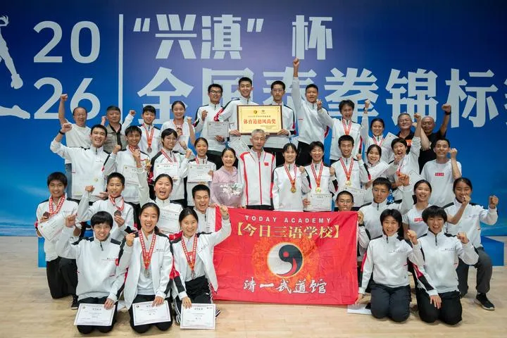
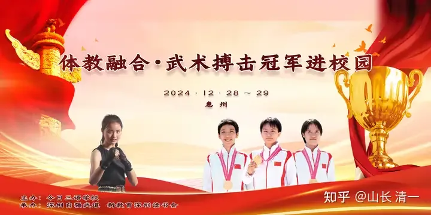

记者十问清一新教育和今日学堂华新记者听说：海外某特区，有一所中国人自办的国际学校。这所学校的教育方针，是以毛泽东思想为指导的。奉行毛主席“教育要革命，学制要缩短”的指示。让学生只用三到四年的时间，就把西方国际学校正常学习12年的课程全部学完了。此举彻底颠覆了已经延续100多年的现代教育体系，还在大幅缩短学制的基础上，明显提高了学业成绩。 学生的SAT平均分是1477分，远远超过全球平均水平（2025年的全球考生平均总分仅为1029分）。而常春藤盟校录取新生的SAT总成绩范围，通常在1450分至1580分之间。因此，该校超过一半的学生，都能达到常春藤的学业成绩标准。如果此事为真，显然该校已经颠覆了传统的西方国际学校模式，全面更新国际教育标准了。最让人意外的，就是该校早在2020年，就已经把探索了20年达成的教育更新奥秘，把如何用四年完成12年课程的整个教育过程，以及教育方法，课件等等，在当年示范班招收11岁学生入学的时候，都全部公布到了网上，供全网免费学习。已经有很多家长，在网上免费跟学该校的教学模式，也创造了类似的教学效果。而这个当年才11岁+的【示范班】学生，现在已经17岁+。目前经过两年的全免费的武道训练，已经拿到了8块泰拳，自由搏击全国锦标赛的金牌，14块银牌，14块铜牌。这些文武双全的学生，目前正在准备申请海外名校。明年批量入读常春藤级别的海外知名大学，基本上毫无悬念！一家私立教育机构，愿意把自己多年探索的，领先全世界的国际教育模式和方法，无私地公布出来，让所有的人都能观摩和学习。此举完全颠覆了西式国际学校收费高昂，让光大工薪阶层无法入读的固有思维模式。让任何人都能零成本入读原本高冷的国际学校。该校所作所为，的确是原来被西方垄断的国际教育行业的颠覆者，必将迎来中国创新教育的标准走向世界，让平价精英国际教育走向民间，让普通中国人也能轻松享有国际优质教育的福利。

更惊奇的是：不仅仅考分高，该校设定的学生高中毕业标准年龄是15岁。在参加完国际高考拿到成绩后，学生将用半年到一年的时间，用来学习大学四年的小语种专业课程，并实现B2-C1的结业成绩。因此该校学生不仅仅英文课程的学业成绩拔尖，还普遍掌握三门以上的语言。学生中掌握四国语言，甚至五国语言的学生比比皆是！但最让人不可思议的地方，就是该校学生还能批量去拿全国格斗锦标赛的冠军，让学生拿了冠军再去上大学！甚至该校学生还有多人代表中国的国家队，2026年就有8人正式入选国家队。为中国拿到了亚洲冠军，世界冠军等荣誉。这所学校的学生，都能成为文武双全的优秀人才。而且，这些去学习中华武术格斗，去打全国锦标赛，训练过程是全国冠军一对一教学辅导，对练陪练。这些高端格斗课程的培训，在国内的武馆里面，都是要数百元甚至上千元一小时收费的。但学生去该校武道馆学格斗，还是该校创始人全额资助的，连吃住都不收钱！因为创始人表示会全力支持这些想要为国争光的年轻人。这样的教育传奇，听起来完全就不像是真的，更像是编出来的玄幻故事。就像是【霸道总裁爱上我】的小视频一样不可信。但记者看到了太多家长传来的照片，似乎也不像是假的！为了一探究竟，记者最近来到海外某特区办学的该校，找到了今日塾的赵校长，开启了我们这次特别的教育寻奇采访。记者一问清一新教育：为啥全世界的学校，基础教育阶段都是12年？你们偏要用三四年时间就完成学业？答 ：毛主席说：一万年太久，只争朝夕！学生们年轻的生命，实在是太宝贵了，孩子们需要学的东西实在太多了。远远不止一点点K12课程内容能够覆盖。一个到18岁，都只会读教材课本的学生，人生的局限性就太大了！但应试的内容，不学也不行。学生考不上好大学，将来就业就很难办。因此，如何提升应试课程的学习效率，提升学业成绩，是今日学堂一直在追求的核心教育目标！毛主席还说：教育要革命，学制要缩短！现在的学生，幼儿园三年，小学六年，中学六年，大学四年，研究生三年，博士生又是四五年，再算上博士后工作站，就不知道多少年了。就算是学生一路考学顺利，等学完全部学历，就已经30岁了，出来工作太晚了。期间还存在恋爱和婚姻问题。特别是对女学生的局限更大，在完成学业和成家，成婚的选择中冲突更大。现在很多人35岁就会被大厂裁员。因此，这种走传统教育路线，一路学下来，还有多少生命能够去为人民服务？当然，我们只是一介小民，管不了别人怎么做，我们只能做好自己的事情。我们学校只是在海外的特区办学，为海外的中华学子服务。学校奉行的教学标准是国际化教育道路，接轨海外大学，并不参与中国的高考，也不影响国内的教育体系。新教育模式的创始人张清一，当初只是希望把自己的孩子教出来，把毛主席的教育指导和原则真正的执行出来。现在已经有数百个家长愿意跟随新教育学习。还有上万的家长，在外面观察和模仿新教育。因为人同此心，心同此理。这些家长，也和创始人有一样的想法，都希望帮助自己的孩子尽可能少吃一点应试教育的苦！这些家庭也希望孩子去海外知名大学上学，获得世界顶尖的优质教育。因此，才会把孩子送到我们的学校来！目前，经过23年不断改进和提高教学方式，今日学堂已经把国际标准的K12教育内容，提前到4年内完成！而且90%的学生，都能达到国际优等生的成绩（SAT1390分以上）！其中50%以上的学生，能够达到国际1%的学生才能取得的优等生成绩（SAT1500分以上）。这些记录全部都有官方考试成绩为证。到今年，今日学堂已经连续三年实现了上述教学指标，这证明新教育的教学效果是非常稳定的，是成功的教育创新。后续9问，且听下回分解！今天暂时只发第一段！

评论附录：清一公社吴俊杰关注我的人山长幽默，摆事实讲道理，用同样的方式回击财新的乱报道。这样的报道才是真实的展现，一定是听参与者也就是学校校长、老师及同学的真实想法，并佐以调查，才是真实的、可信的。不然就是听几个退出者的只言片语，就好比问考不出驾驶证的人开车是容易还是简单、问不会讲汉语的老外中文好不好学、问理发师我需不需要剪头发一样，都是片面不真实的。5 小时前 · 浙江​回复​12冼华贞关注我的人现在想要学新教育的家庭太幸福了，在家就可以带着孩子自己学（2020年今日学堂无私的同步将整个教育过程，以及教育方法，课件等等，都全部公布到了网上，供全网免费学习）13年前我们接触到新教育还没有那么好的条件，羡慕看懂新教育的家庭。“幼吾幼，以及人之幼”感恩山长的大爱让我们普通家庭也有了让孩子进入学习的机会。5 小时前 · 广西​回复​7

黄红珍关注我的人在读今日学堂的学生家长，跟随清一新教育学习的家长们慧眼明亮！

华新记者事实报道！此举完全颠覆了传统国际学校收费高昂，工薪阶层无法入读的固有思维模式，让任何人都能零成本入读国际学校。的确是欧美国际教育的行业颠覆者，必将迎来中国教育标准走向世界的新篇章。5 小时前 · 河南​回复​6

褚海云关注我的人四年就可以学完12年，孩子还学的开心快乐，多出的其他时间可以做更有意思的事。

我就是其中的家长之一，希望帮助自己的孩子尽可能少吃一点应试教育的苦！选择上这个教育的，我的孩子非常喜欢！5 小时前 · 浙江​回复​5一真李明静关注我的人教育要革命，学制要缩短。清一新教育只用4年就完成别人12年才能完成的功课。极大的节省了学生的生命，使学生有更多的时间去学习其他更有价值的东西，比如武术！这实在是太有开创性，太有竞争力了。我想这是每一个家长都想要的。4 小时前 · 广东​回复​4在路上关注我的人10年前接触清一新教育，认为是全世界最好的教育，后来孩子也考进了今日学堂，10年后仍没有发现比清一新教育更好的教育！这10年我们家庭和孩子都得到了清一新教育的托举！感恩山长、刘老师和老师们4 小时前 · 河北​回复​4

郑婉芳关注我的人【教育要革命，学制要缩短】毛爷爷的教导，清一新教育做到了。3 小时前 · 广东​回复​3

丁海梅关注我的人真实不虚

我的孩子就是其中之一，前两年半几乎都在运动和心性调整，最后一年半才开始集中学习，四年后考了1490分，这只是均分靠上一点，我作为家长都觉得不可思议。所以山长是在玩最有趣的教育游戏，孩子们喜欢

感恩山长和刘老师的智慧和大爱！3 小时前 · 内蒙古​回复​3

宋丽关注我的人心性到位了，连四年都要不到。我家的也就最后半年是全力以赴的3 小时前 · 四川​回复​3

冯云龙关注我的人实事求是！我们家是践行学校教学理念的受益者,也学校23年发展的的见证者！感恩山长和刘老师！

龙永明关注我的人伟大领袖说得对，“教育要革命，学制要缩短。”确实想想都可怕，按照传统的步骤来，30岁左右才开始就业，很多大厂35岁的老员工，就开始被裁员了，加上婚恋，还有多少时间“服务人民呢？”实际上4年都不要，我娃一年前连乘法口诀都不会，一年后五月份首考，SAT成绩1510。现在开始零基础学日语，报了十二月份的日语考试，目标是三个月拿下日语N2等级证书，拭目以待吧。1 小时前 · 浙江​回复​1

巩彦霞关注我的人我是新教育孩子的家长。在日常中我看到学堂的孩子们状态绽放喜悦，精气神十足。和孩子们相处发现，孩子们思路清晰，懂得如何做事、承担责任。学堂文武兼修，文可上藤校，孩子善于思考，懂得踏实做事。武的不止是强身健体，孩子们站上赛场奋力拼搏，打出冠军，在这个过程中不断提升体魄与意志。孩子们在成长中练就自己的本事，同时又有服务他人、服务社会的心。作为家长，看到孩子这样成长，我内心非常满意。2 小时前 · 天津​回复​2

颐松豪关注我的人学习实践毛主席的伟大智慧3 小时前 · 老挝​回复​3

崔志勇关注我的人结缘清一山长和清一新教育是我们三生有幸！感恩！🙏🌹4 小时前 · 湖南​回复​3

易安关注我的人提升应试课程的学习效率，提升学业成绩，是今日学堂一直在追求的核心教育目标！经过23年不断改进和提高教学方式，今日学堂已经把国际标准的K12教育内容，提前到4年内完成！而且90%的学生，都能达到国际优等生的成绩（SAT1390分以上）！其中50%以上的学生，能够达到国际1%的学生才能取得的优等生成绩（SAT1500分以上）。这些记录全部都有官方考试成绩为证。到今年，今日学堂已经连续三年实现了上述教学指标，这证明新教育的教学效果是非常稳定的，是成功的教育创新。今日学堂颠覆了西方传统的教育体系，创造了世界教育奇迹，为全世界的学子闯出了一条学习语言的新路，一条人生成长的康庄大道4 小时前 · 广东​回复​4

盛志惠关注我的人清一新教育｜让平价精英国际教育走向民间，让普通中国人也能轻松享有国际优质教育的福利。

不需要用12年学习体制的东西，仅三四年就可以了，把宝贵的时间拿来学习更重要的人生课程，为未来打下坚实的基础！#清一新教育#文人格斗#今日学堂#清一山长3 小时前 · 江苏​回复​2

李应军关注我的人就是真实存在，怎么做也假不出来啊。

3 小时前 · 浙江​回复​2

海清关注我的人太好了！新教育4年学完12年，帮助孩子们快速拿下学业，缩短时间去做更多有意义的事情！4 小时前 · 云南​回复​2

杨维波关注我的人4 小时前 · 浙江​回复​2

爱是阳光关注我的人高质高效，文武双全

4 小时前 · 云南​回复​1

不断提升的陈媛媛关注我的人学制缩短造福太多新教育孩子，支持山长支持新教育，期待下文

4 小时前 · 广西​回复​1

赵雯杰关注我的人“这所学校的教育方针，是以毛泽东思想为指导的。奉行毛主席“教育要革命，学制要缩短”的指示。让学生只用三到四年的时间，就把西方国际学校正常学习12年的课程全部学完了。”山长写得太好了

4 小时前 · 甘肃​回复​1

上善若水a关注我的人这样的采访还真的有事实有依据，继续跟踪后续报道

4 小时前 · 江西​回复​2

王华关注我的人是啊，都说教育要改革，要素质教育，不要只围绕着分数转，不要僵化，要德智体美劳全面发展（毛主席说：“野蛮其体魄，文明其精神”），新教育高效地解决了分数问题，让孩子们用最短的时间完成应试教育的内容任务，节约出大量的时间运动健身，学习优秀中华文化智慧，打好人生成长根基，实实在在地解决了孩子、家长的痛点，这是利国利民利家的大好事啊

3 小时前 · 云南​回复​1

婉清关注我的人感谢真实报道

4 小时前 · 福建​回复​1

徐小娥关注我的人期待下文

5 小时前 · 浙江​回复​1

易安关注我的人毛主席他老人家早就看到了教育的弊端提出了“教育要革命，学制要缩短”的教育指导思想

新教育完美地实现了伟大领袖的愿望不仅用4年就学完了12的课程而且取得了全球1%的学生才能取得的优等成绩新教育的教学成果非常稳定是成功的教育创新必将成为全球教育的创新典范

3 小时前 · 广东​回复​1

慧谦关注我的人4年学完12年的教育，清一新教育实实在在做到了。其实还根本不用4年，前面两年都在调心性，后面才正式学习52 分钟前 · 云南​回复​喜欢

一生皆是错关注我的人孩子们需要学的东西实在太多了。除了中医，还有啥？道家思想？1 小时前 · 山东​回复​喜欢

崔志勇关注我的人这才是真实的现状！我就不明白那个“财迷记者饭不加”的胡说八道是怎么闭着眼睛瞎扯出来的？人性啊，不要脸了就天下无敌，闭上眼睛把脸一抹……
