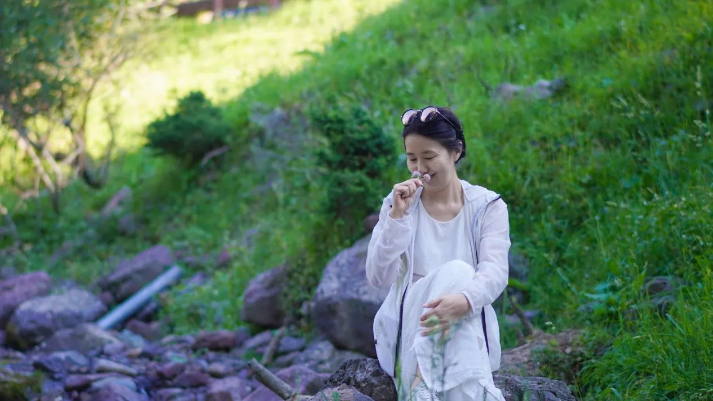

你真是一个很有福报的母亲，过去几年，也看到了你们作为家长，对孩子的完全的支持和托举。还真没想到，短短几年后，你的几个女儿居然都大学毕业了。

你教会了孩子们学会珍惜，和尊重。你允许孩子们走不同的道路和选择，因此你们家才这么有福气。祝福你们家一切顺心如意

清一新教育｜不适合自己的路 ，不必诋毁他人的选择｜写给所有理性看待教育的父母305 赞同 · 77 评论 文章

作者：山长 清一
链接：
来源：知乎
著作权归作者所有。商业转载请联系作者获得授权，非商业转载请注明出处。
