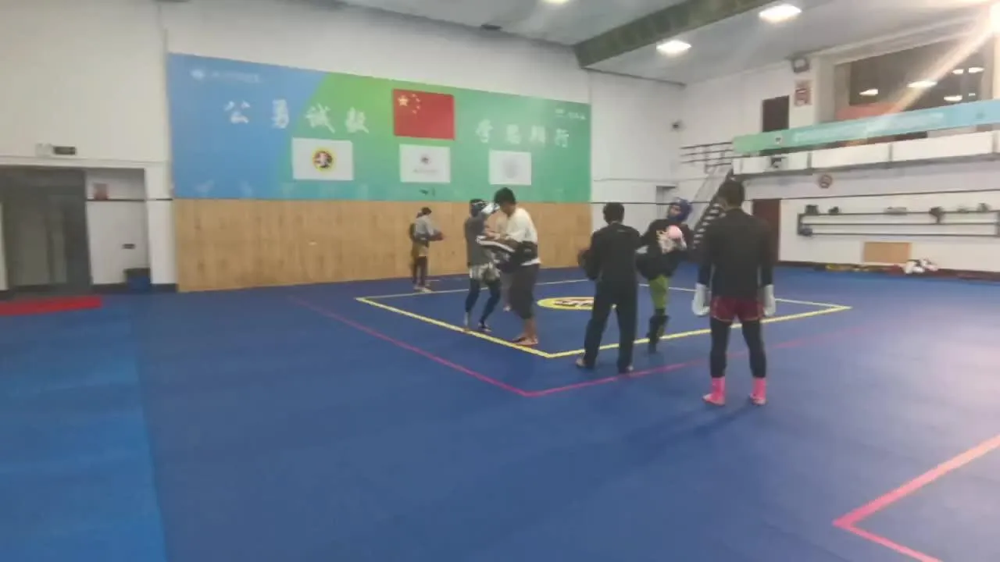

实际上，女子四个级别，四块金牌全部到手。男子两块金牌到手。首次成为全国第一战队。

2026年应该是7块金牌（送掉一块）。再次排名全国第一！

我相信2027年回更多。这一年，我们将参加女子六个级别的比赛，争取女子拿到六块金牌。

男子继续两块金牌吧！

张清一：回武汉参加全国锦标赛，开启狂卷节奏406 赞同 · 57 评论 文章

作者：山长 清一
链接：
来源：知乎
著作权归作者所有。商业转载请联系作者获得授权，非商业转载请注明出处。
