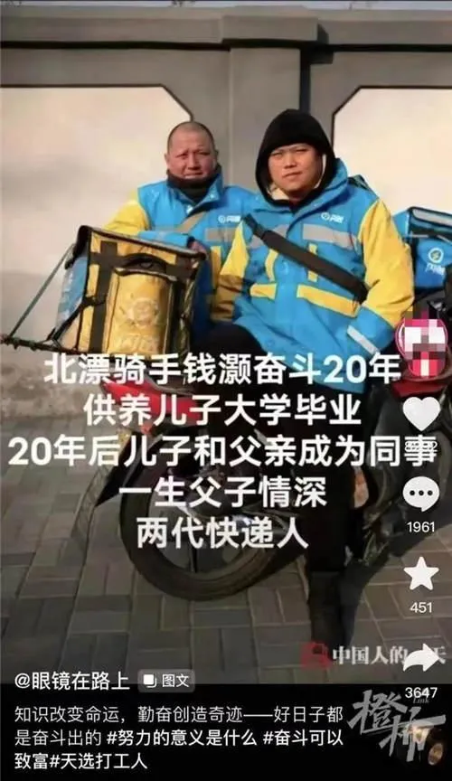

学制可以缩短。

学制缩短以后，中学毕业生只有十五六岁，不够当兵年龄，也可以过军队生活。不仅男生，女生也可以办红色娘子军，让十六七岁的女孩子去过半年到一年的军队生活。

现在课程多，害死人，使中小学生、大学生天天处于紧张状态。课程可以砍掉一半。学生成天看书，并不好，可以参加一些生产劳动和必要的社会活动。

现在的教学系统，根本就没有执行毛主席的教学思想。依然是封资修的旧社会教学方式，的确如毛主席所说：是摧残青年的

今日学堂一直在认真贯彻执行毛主席关于教育革命的指示

15岁就高中毕业，虽然我们无法去参加现代的军队，但我们学军事化管理。学生15岁就参加武术训练，去打擂台，去为国争光！让学生更加坚韧，更加有信心去面对社会生活的种种考验！而不会从小只学知识，只会考试，导致脆弱无能。

感慨万千！毛主席论教育革命97 赞同 · 3 评论 文章

